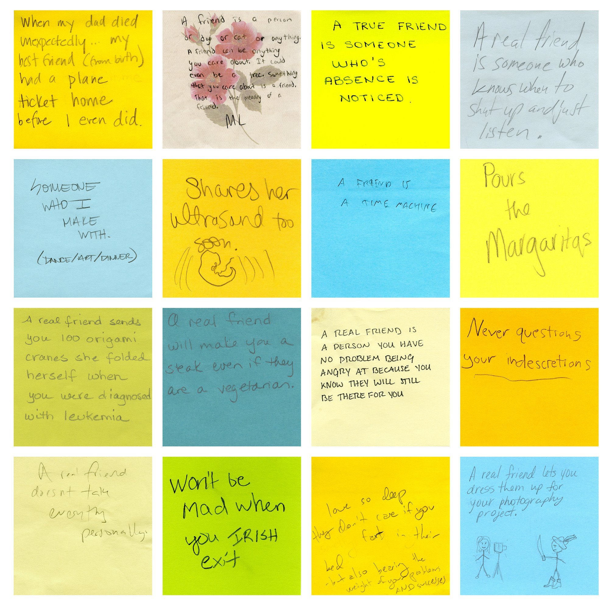

## Motivation

On a recent visit to MASS MoCA, I came across Tanja Hollander’s “Are you really my friend?” exhibit. [1] At the end of the exhibit, there’s a room with a wall of post-it notes trying to answer the question “What is a true friend?”. Next to the wall, there are a few sofas and desks, and a stack of post-it notes for museum-goers to add on to the collection. As I watched other people in the room sit down and scribble down thoughts, I was struck by just how accessible this exhibit was. Everyone could relate to it, and even kids were jotting down ideas and contributing to the process. Our proposal builds off this idea of breaking down the elusive nature of art engagement and creating a more interactive and inclusive experience.

<figure>

<figcaption>Post-its at the MASS MoCA exhibit[1]</figcaption>
</figure>

## The Problem

Art provides a medium for self-expression that relates people and their experiences in an inherently human way. Art museums, a primary resource for learning about and experiencing art, are meant to invite the general public and people to engage in this creative dialogue. However, this conversation about art can feel intimidatingly inaccessible for the general public. For regular people, who aren’t academics or involved in the “art world,” art can feel elusive, out-of-touch, or even perhaps just confusing. In fact, the homogeneity of the art world is a well-documented and studied problem, where “among those who frequented art museums, a stunning 92 percent identified as white, and only 16 percent identified as a minority.”[2]  Without a formal introduction to art, which is generally only available to the privileged, it’s hard to glean a lot of insight from the works in front of you. Part of this problem is both the little information provided by the display of works at museums and the lack of informal resources for engaging in conversations about art.

## The Proposal

Our proposal aims at exploring new ways to interact with art by allowing users to share experiences and information about the pieces through a digital platform. While looking around at museums, users can, with their phones, take a picture of a piece of art (or simply type in the name) and pull up that piece of art’s “profile” on their mobile device.  
The profile would serve to provide any lacking foundational background information about the piece and facilitate social discussion for forming new outlooks and perspectives about the art.

## Background information

While the placards and artists bios displayed with works at museums are helpful, most pieces themselves only have a small placard listing the artist, date, and perhaps who it was donated by. We think many people would “understand” art better by learning about the artist’s motivations and intentions. This app would allow museum-goers to easily pull up background information about any piece of art, and thereby explore new art through a “related artists” section. Users could also learn about what this “genre” of art is, how/where/why it developed, and thereby begin to develop a vocabulary about art in general. The app could also offer suggestions based on what kinds of art the user has bookmarked, and thus allow the user to constantly explore new art even after they’ve left the museum.

### Social Discussion

Since art is never meant to be a solitary but a social human experience, the “comments section” on a piece of art creates a space for informal discussion and creating new knowledge with other passionate individuals. Users can read comments from other users, make their own comment about how different pieces impact them their opinions, and save the piece (like a bookmark), or share it on social media. 

This space allows the art museum experience to move from a conversation between the curator and the museum-goer, to a conversation between “regular people.” It allows users to learn about art through the experiences of other people, which is valuable to an understanding of what art is. We don’t want our museums to feel “stuffy” and pretentious; that’s how we end up with a homogenous museum-going base. It also allows users to feel connected to art, by allowing them to define their individuality in finding specific pieces more impactful, saving those pieces, and being able to go back and look at their collection later.

## Sources

1: ["Tanja Hollander, Are you really my friend?": MassMoCA](http://massmoca.org/event/tanja-hollander/)

2: ["Does the art world have a demographics problem?": Big Think](http://bigthink.com/Picture-This/does-the-art-world-have-a-demographics-problem)  

