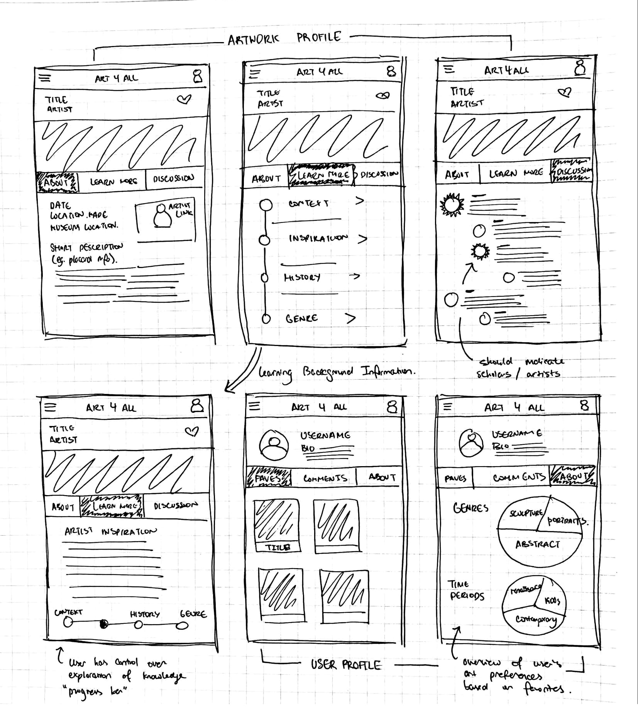
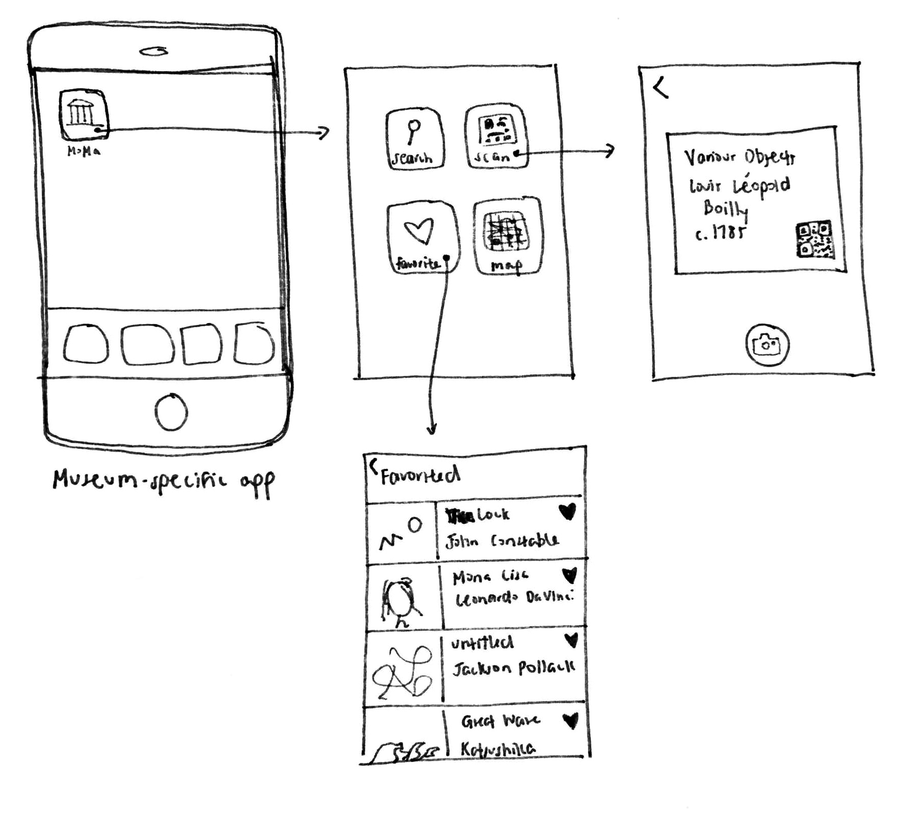
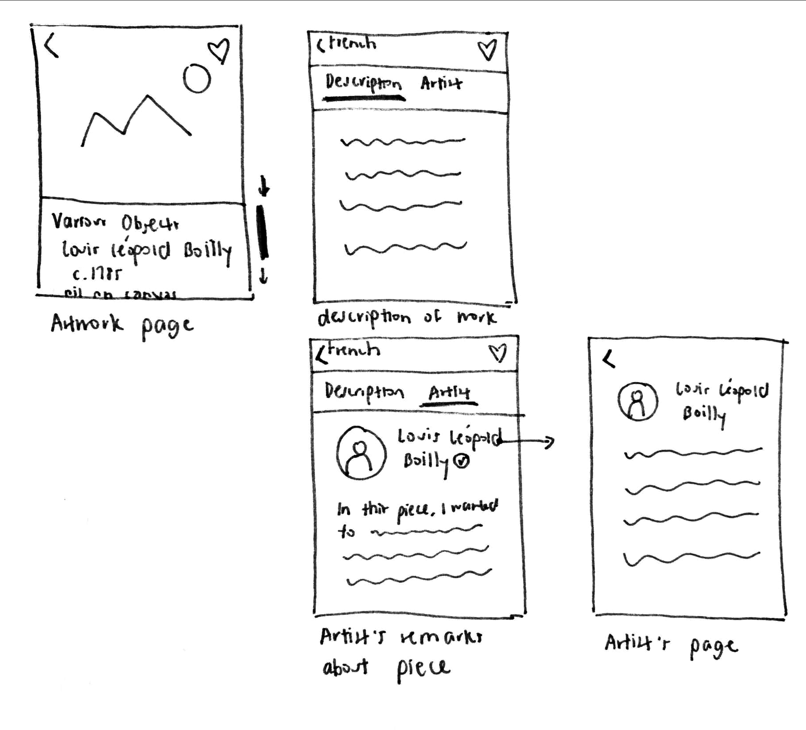
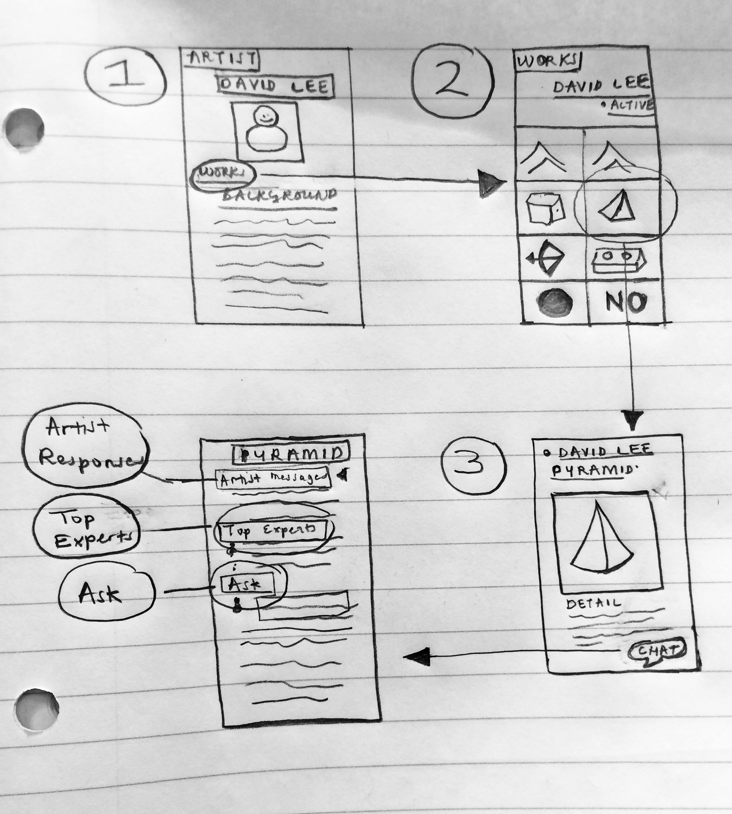

Note: See the [supported tasks](../Supported-Tasks) page for information about tasks.

## First Design

<figure>

<figcaption>Sketch of first design</figcaption>
</figure>

**Tasks:** Background information, contexts, discussion, favoriting, and remembering

**Main Idea:** This design focuses on how we might layout a particular “art profile” and the discovery of new information about the artwork, as well as user and artist profiles. The artwork is presented as a central page, where “about”, “learn more”, and “discussion” are the main focuses and the user can tab between them. 

**(Tasks 1 & 4) Learning:** The “about” tab includes placard-like explanation. The “learn more” tab on the artwork’s profile allows the user to make an individual choice about which aspect of the background information she’d like to explore. For further exploration, there will be a series of different aspects of the artwork’s background info. Elliot, who likes history, can specifically choose the history tab. In addition, there is a small “progress bar” at the bottom that allows the user to navigate to more information if their curiosity is not yet satisfied. Logan, who wants to learn about the inspiration, can navigate to the “inspiration” section. 

**(Tasks 2, 5, 8) _Discussion:_** The “discussion” tab on the artwork’s profile allows the users to talk with each other and with scholars and artists in the field to learn about the artwork in a more informal/colloquial setting. Both Anna and Caroline can use this functionality to hear about others’ experiences. The scholars/artists who participate in the discussion will have special annotations on their icons to indicate that they are professionals in their field, and the particular artist of the work will have a distinct icon so they can reliably answer questions that come up.

**(Task 6) _Favoriting Artworks:_** On the “art profile,” there is a button on the upper-right corner (the heart) that allows the users to favorite the work they are looking at. In addition, on the user profile page, Chelsea can look through her past favorites in the “favorites” tab, and also look at an overview of what her favorite pieces were like in the “about” tab. The “about” tab will show her what the breakdown of her favorite artworks is, by genre, time period, or possibly any number of things.  

**(Task 3) _Remembering Artworks:_** In the user profile, there will be a tab for “favorites.” The user can then look through the artworks they favorited and reflect on what they’ve enjoyed the most in the past. Carlos can use this functionality to keep tabs on all his favorite works, and learn more about them from the comfort of his own home. 

## Second Design
**Tasks:** finding background information, breaking down formal art terms, getting more context,
artist communicating with people about the work

**Main Idea:** This design is museum-centric. The mobile application is museum-specific and primarily for real-time use while visiting museums. The design allows users to more easily access information about art pieces that are sometimes available in museums, currently in the form of wall text and pamphlets, but now more directly in a centralized source. It provides streamlined, simple information about the piece. This design provides a text search option, a QR code search option, favorites page, and a location-based map of the museum.

<figure>

<figcaption>Sketch of second design: Main navigation</figcaption>
</figure>

**(Task 1) _Reading placards and finding background information about artworks:_**
The search and QR scan options allow users to quickly find the pages for artworks. All artwork pages include an image of the work and ID information, such as title, artist, date, etc, that might usually be placed on placards.

<figure>

<figcaption>Sketch of second design: Art Profile</figcaption>
</figure>

**(Tasks 1 & 4) _Understanding more context about art pieces:_**
Scrolling down the Artwork Page reveals a two-tab menu option with “Description” (a brief analysis/explanation of the work) and “Artist” (an artist’s statement on the piece). Elliot and Logan can choose the “Description” tab when they want to learn more.

**(Task 7) _Breaking down formal art interpretations into understandable terms:_**
The “Description” tab also includes links to basic terms, such as “Surrealism,” which links to a nested page with a definition of the term in easy-to-understand language that Syd can use to develop more understanding about art. 

**(Task 8) _Artist communicating to people interested in her work:_**
The artist tab includes what the artist would like his/her audience to know about the specific work. Jordan can use this to explain additional information if questions come up. If the artist is current enough, the artist name links to a nested Artist Page, where background information about the artist is provided.

## Third Design 

<figure>

<figcaption>Sketch of third design</figcaption>
</figure>

**Tasks:** Understanding more context about art, discussing art with museum experts and novices, Finding background information about art. 

**Main Idea:** This design is focused connecting the artist to the museum-goer to enhance the latter’s understanding of an artist’s work. It also introduces a digital space to chat with the artist, other museum-goers, and art experts. The design is designed to be mobile-centric.

**(Task 4) _Understanding Context:_** The main page shows an artist’s profile. It goes into more depth than the traditional wall text or placard. At the top of the page is the artists name, below that we have the image of the artist. The image is followed by a link to the artist’s works. A brief but thorough description of the artist forms the main content of the page. A museum goer like Logan can get more context about an artwork by getting insights from the artists biography. 

**(Task 1) _Background Information:_** After clicking the “works” link indicated above, a user is presented with a picture gallery of all the works by an artist. A user like Elliot who wants to understand the background of an artwork can see an artist’s work in relation to other works by the same artist. Clicking on an artwork will further lead to a page about the artwork and offers more detail and context.

**(Task 2) _Discussion with fellow museum-goers:_** Below an artwork’s description is a chat bubble with a link that leads to a digital space that fosters discussion among the artist, museum-goers, and scholars in the field. The user is able to ask question about an artwork and respond to other users. 

**(Task 5 & 8) _Discussion with experts and artist:_** On top of the discussion page is a list of most recent answers from an artist. Below that is a list of experts. A user can read past discussion and post questions. He is able to interact with both the artist and experts (if he chooses to).

## Citations
1. [Dorothea Lange's "Migrant Mother" Photographs in the Farm Security Administration Collection: An Overview](http://www.loc.gov/rr/print/list/128_migm.html)

