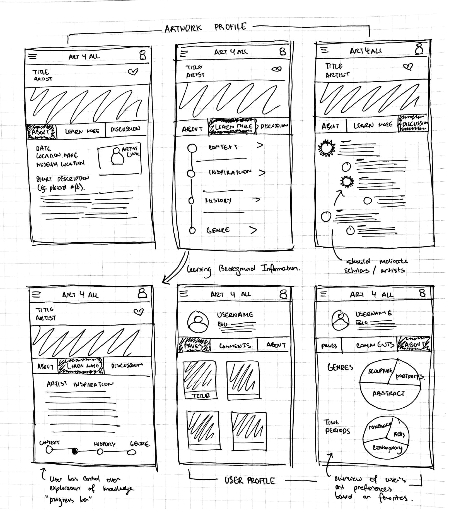
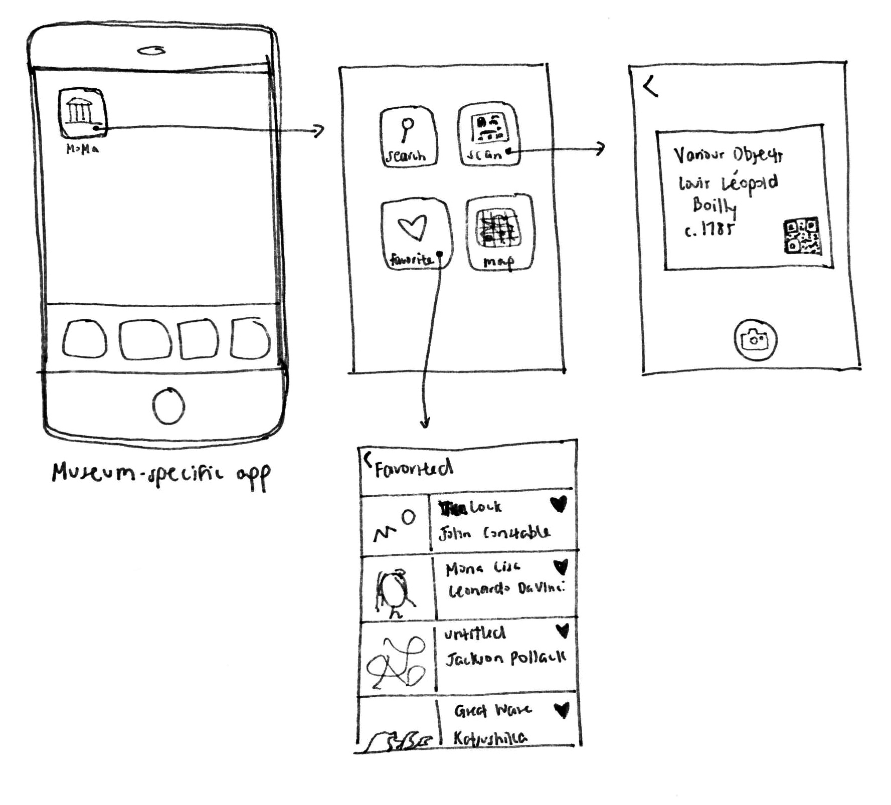

## Existing Tasks:

### 1. _Reading placards and finding background information about artworks_ - Hard task
Elliot is a junior majoring in history at Amherst. He likes going to museums to learn about history from a visual perspective, and he decides to attend a local art museum on the weekend. He sees an 18th century piece he really likes and reads the placard, but it names only the artist, date, and title of the work, and there is only explanatory wall text for the featured exhibits. He appreciates the art for what it is but feels he is missing part of the puzzle by not knowing anything about the connection between the artist and the work, and especially the history behind it. He writes down the name of the artwork for later, and continues on. When he returns from the museum, he googles the title of the piece hoping to learn more about it. Unfortunately, the artwork he liked so much was made by a lesser-known artist, so there isn’t much on the Internet about it. He does find a few scholarly articles about the artist, but they’re filled with confusing language and art terminology that he doesn’t understand.

### 2. _Discussing art with others in person_ - Moderate task
Anna is a frequent attender of museums, and likes to explore new kinds of art. She visits a contemporary art exhibit with a group of friends in a new city. As they’re walking around, a passer-by suggests they go up close to look at the exhibit featuring mirrors, because it provides a different perspective. As they take turns looking at themselves in the reflections, they share thoughts about the experience, and they notice that they all have different opinions on the installation based on their experiences with looking at their own reflections. They feel they have learned about themselves, about each other, and about the power of art to make us think about ourselves, through this discussion. 

### 3. _Appreciating and remembering art after a museum visit_ - Easy task
Carlos loves visiting museums, and he finds that certain artworks spark something in him that he just can’t describe. For these pieces, he tries to write them down somewhere so he can remember them for later–sometimes in a journal, sometimes in his “Notes” app on his phone. If the piece is part of a permanent exhibit, he jots that down too so he can visit it again the next time he comes to that museum. He also sometimes buys postcards or artist booklets at the museum so he can appreciate the art and look back on it even after he’s left the museum, but those can get pretty expensive.

## New Tasks:
### 4. _Understanding more context about art pieces_ - Hard task
Logan is visiting New York and decides to visit the famous MoMA, but he doesn’t know much about art and has no formal art training. He’s looking at the famous “Migrant Mother” photograph, and the placard notes that it was taken in 1963 in Nipomo, California by Dorothea Lange, but he gets no other information. He can feel the desperation in the image, but wants to learn more. Who is the woman in the photograph and why does she look like she’s suffering? He navigates to the photograph’s profile on the app and reads some basic information about the artwork. He learns that Lange was spending a month photographing migratory farm labor when she took this shot. He reads Lange’s account of her experience, and learns that the mother in the photograph “said that they had been living on frozen vegetables from the surrounding fields, and birds that the children killed. She had just sold the tires from her car to buy food.”[1] Logan feels like he can now better understand the emotional energy of the photograph.

### 5. _Discussing art with museum experts and novices_ - Moderate task
Caroline is a flight attendant for a major airline company. Every now and then she finds herself stuck in a major city with nothing to do. To pass the time before her next assignment, she often visits museums. She does not have any formal background in art, and would rather spend her time at home with her children than reading books on art. Because she’s usually away for work in random cities, she doesn’t always have friends to go to museums with, but she still wants to discuss the art with “regular” people and potentially scholars if they use colloquial language. At her next stop in Toledo, she visits an art museum, and finds a really interesting abstract art piece that she doesn’t quite understand. She doesn’t really want to spend time reading about background information; she finds that process kind of boring. Instead, she navigates to the artwork’s profile on the app, and reads about other people’s experiences with the piece. She is fascinated with how others describe their experiences with art, and the language they use to convey their emotions. She is also impressed by the insights she gains by reading responses from scholars who use colloquial language. She is surprised to find that people took on very varied interpretations of the art, and slowly begins to develop the confidence to decide for herself what the artwork means to her. She even adds her own comment, and feels pride in participating in this discussion and adding her own take. 

### 6. _Favoriting artworks_ - Easy task
Chelsea is an avid art-lover, and loves visiting art museums in her spare time. She visits a new museum that just opened in her city, and stumbles upon a painting that she is immediately entranced by. She wants to remember this artwork somehow, so that she can look back on it later and remember how it made her feel. She uses the app to navigate to the painting’s profile and “favorite” it. That night at home, she thinks more about the painting and other artworks that have impacted her. She pulls up the app to see all of the artworks she’s favorited in the past. She goes through some of them, and nostalgically remembers how she felt at each time, and even thinks about the context in her life when each of these artworks was particularly meaningful to her. As she scrolls through, she notices that most of the artworks she’s favorited have been paintings and abstract art, and feels like she’s learned something about her own personal style of expression through this.

## Extra Tasks:
### 7. _Breaking down formal art interpretations into understandable terms_ - Hard task (Existing)

Syd has had no formal experience studying art and so is not familiar with the formal terms used to describe art. However, she enjoys going to art museums on the weekend with her friends. On one visit, the pamphlets about the artworks use a lot of formal language she doesn’t understand. She asks her friends what they mean. However, there are some parts that are not understandable to her friends either. In these cases, she uses her phone to google each term, and after identifying appropriate definitions, she is able to piece together what the pamphlet is talking about.

### 8. _Artist communicating with people interested in her work_ - Moderate task (New)

Jordan Mitchell is a rising modern artist with a number of nationwide exhibitions. Her artwork is revolutionary and can be hard to understand for both art novices and experts. She often attends museum events, explains her work, and interacts with people interested in her work. However, she is unable to attend as many events as she would like to. She communicates with both novice and experienced museum goers. She is able to explain her work, and respond to any of their questions. This helps breakdown the barriers preventing people to understand her revolutionary artwork. It is also a way for Jordan to get real time feedback on how people see her artworks.

## First Design

<figure>

<figcaption>Sketch of first design</figcaption>
</figure>

**Tasks:** Background information, contexts, discussion, favoriting, and remembering

**Main Idea:** This design focuses on how we might layout a particular “art profile” and the discovery of new information about the artwork, as well as user and artist profiles. The artwork is presented as a central page, where “about”, “learn more”, and “discussion” are the main focuses and the user can tab between them. 

**(Tasks 1 & 4) Learning:** The “about” tab includes placard-like explanation. The “learn more” tab on the artwork’s profile allows the user to make an individual choice about which aspect of the background information she’d like to explore. For further exploration, there will be a series of different aspects of the artwork’s background info. Elliot, who likes history, can specifically choose the history tab. In addition, there is a small “progress bar” at the bottom that allows the user to navigate to more information if their curiosity is not yet satisfied. Logan, who wants to learn about the inspiration, can navigate to the “inspiration” section. 

**(Tasks 2, 5, 8) _Discussion:_** The “discussion” tab on the artwork’s profile allows the users to talk with each other and with scholars and artists in the field to learn about the artwork in a more informal/colloquial setting. Both Anna and Caroline can use this functionality to hear about others’ experiences. The scholars/artists who participate in the discussion will have special annotations on their icons to indicate that they are professionals in their field, and the particular artist of the work will have a distinct icon so they can reliably answer questions that come up.

**(Task 6) _Favoriting Artworks:_** On the “art profile,” there is a button on the upper-right corner (the heart) that allows the users to favorite the work they are looking at. In addition, on the user profile page, Chelsea can look through her past favorites in the “favorites” tab, and also look at an overview of what her favorite pieces were like in the “about” tab. The “about” tab will show her what the breakdown of her favorite artworks is, by genre, time period, or possibly any number of things.  

**(Task 3) _Remembering Artworks:_** In the user profile, there will be a tab for “favorites.” The user can then look through the artworks they favorited and reflect on what they’ve enjoyed the most in the past. Carlos can use this functionality to keep tabs on all his favorite works, and learn more about them from the comfort of his own home. 

## Second Design
**Tasks:** finding background information, breaking down formal art terms, getting more context,
artist communicating with people about the work

**Main Idea:** This design is museum-centric. The mobile application is museum-specific and primarily for real-time use while visiting museums. The design allows users to more easily access information about art pieces that are sometimes available in museums, currently in the form of wall text and pamphlets, but now more directly in a centralized source. It provides streamlined, simple information about the piece. This design provides a text search option, a QR code search option, favorites page, and a location-based map of the museum.

<figure>

<figcaption>Sketch of second design: Main navigation</figcaption>
</figure>

**(Task 1) _Reading placards and finding background information about artworks:_**
The search and QR scan options allow users to quickly find the pages for artworks. All artwork pages include an image of the work and ID information, such as title, artist, date, etc, that might usually be placed on placards.

<figure>

<figcaption>Sketch of second design: Art Profile</figcaption>
</figure>

**(Tasks 1 & 4) _Understanding more context about art pieces:_**
Scrolling down the Artwork Page reveals a two-tab menu option with “Description” (a brief analysis/explanation of the work) and “Artist” (an artist’s statement on the piece). Elliot and Logan can choose the “Description” tab when they want to learn more.

**(Task 7) _Breaking down formal art interpretations into understandable terms:_**
The “Description” tab also includes links to basic terms, such as “Surrealism,” which links to a nested page with a definition of the term in easy-to-understand language that Syd can use to develop more understanding about art. 

**(Task 8) _Artist communicating to people interested in her work:_**
The artist tab includes what the artist would like his/her audience to know about the specific work. Jordan can use this to explain additional information if questions come up. If the artist is current enough, the artist name links to a nested Artist Page, where background information about the artist is provided.

## Third Design 

<figure>

<figcaption>Sketch of third design</figcaption>
</figure>

**Tasks:** Understanding more context about art, discussing art with museum experts and novices, Finding background information about art. 

**Main Idea:** This design is focused connecting the artist to the museum-goer to enhance the latter’s understanding of an artist’s work. It also introduces a digital space to chat with the artist, other museum-goers, and art experts. The design is designed to be mobile-centric.

**(Task 4) _Understanding Context:_** The main page shows an artist’s profile. It goes into more depth than the traditional wall text or placard. At the top of the page is the artists name, below that we have the image of the artist. The image is followed by a link to the artist’s works. A brief but thorough description of the artist forms the main content of the page. A museum goer like Logan who wants to get more context about an artwork can get more context about an artwork by getting insights from the artists biography. 

**(Task 1) _Background Information:_** After clicking the “works” link indicated above, a user is presented with a picture gallery of all the works by an artist. A user like Elliot who wants to understand the background of an artwork can see an artist’s work in relation to other works by the same artist. Clicking on an artwork will further lead to a page about the artwork and offers more detail and context.

**(Task 2) _Discussion with fellow museum-goers:_** Below an artwork’s description is a chat bubble with a link that leads to a digital space that fosters discussion among the artist, museum-goers, and scholars in the field. The user is able to ask question about an artwork and respond to other users. 

**(Task 5 & 8) _Discussion with experts and artist:_** On top of the discussion page is a list of most recent answers from an artist. Below that is a list of experts. A user can read past discussion and post questions. He is able to interact with both the artist and experts (if he chooses to).

## Citations
1. [Dorothea Lange's "Migrant Mother" Photographs in the Farm Security Administration Collection: An Overview](http://www.loc.gov/rr/print/list/128_migm.html)

