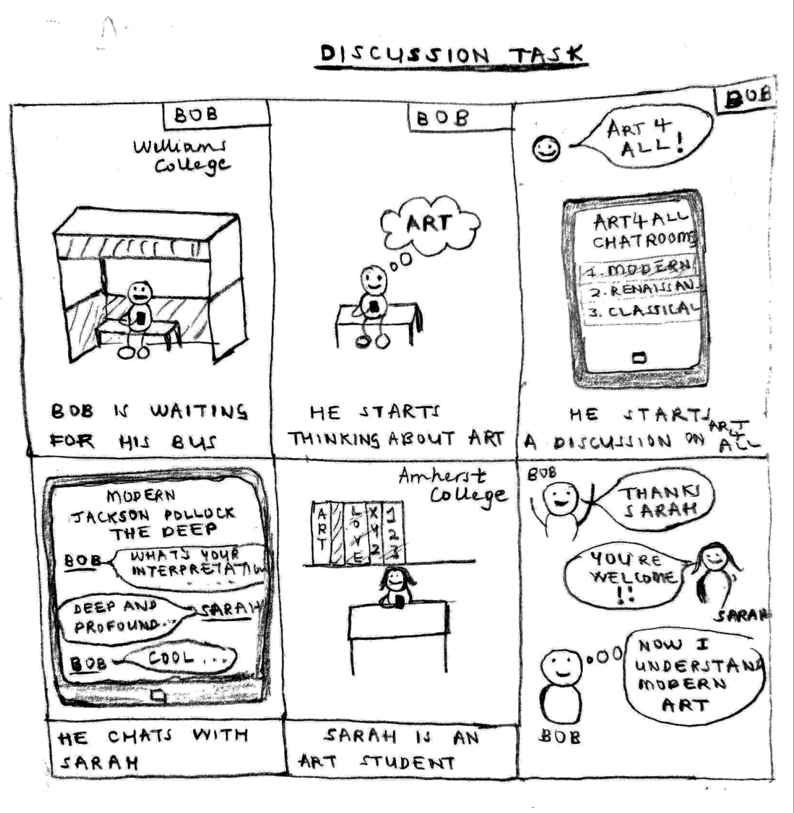

## Updated Design

We decided to combine parts of each of the first two designs in our final design. We decided to use the second museum-centered design as the basis for our app because when we did our contextual inquiries, we realized that most people don’t actually look at or find art on their own; they come to museums for that purpose. We also wanted to keep the map from the second design because our contextual inquiries revealed that navigating effectively through museums and from one exhibit to the next can be a challenge for people. We also kept the QR codes featured in that design, because we noticed when visiting MASS MoCA that many modern exhibits these days aren’t just framed artworks, so they would be harder to detect by just snapping a picture. In addition, some exhibits don’t allow camera use inside, so the QR code could be placed just outside the exhibit with the wall text. From the first design, we wanted to keep the tabs that toggle between “About”, “Learn More” and “Discussion,” because we didn’t feel like there was a streamlined sequence of events for people when viewing an artwork (i.e. they didn’t first read the background, then ask questions, and then discuss the art; they often went back and forth). 

<figure>

<figcaption>Updated Design</figcaption>
</figure> 

## Tasks

Our two selected tasks are finding background information about an artwork, and engaging in an online chat room focused on art discussion.
Finding background information is an activity that is central to the museum experience. We found during our contextual inquiries that all of the people we talked to came to the museum to learn about art, although some emphasized different aspects of that learning. In either case, we definitely wanted to highlight this learning aspect in our app.
For the discussion side, we mostly interviewed people who were already in groups, and we noticed how they enjoyed talking to each other about the art as they went along. The discussion task will thus allow for a wider conversation to take place with a more diverse set of people. In addition, people who find themselves visiting a museum alone will still get to discuss their experience. The user is put in conversation with the museum when he observes the museum, and finds background about an artwork. Art is a social experience. A museum-goer should not only be able to communicate with an artwork but with other museum-goers. This allows for cross pollination of ideas and different interpretations of art.

## Storyboards

<figure>

<figcaption>Storyboard 1: Finding background information task </figcaption>
</figure> 

<figure>

<figcaption>Storyboard 2: Participating in online discussions about art task</figcaption>
</figure> 

