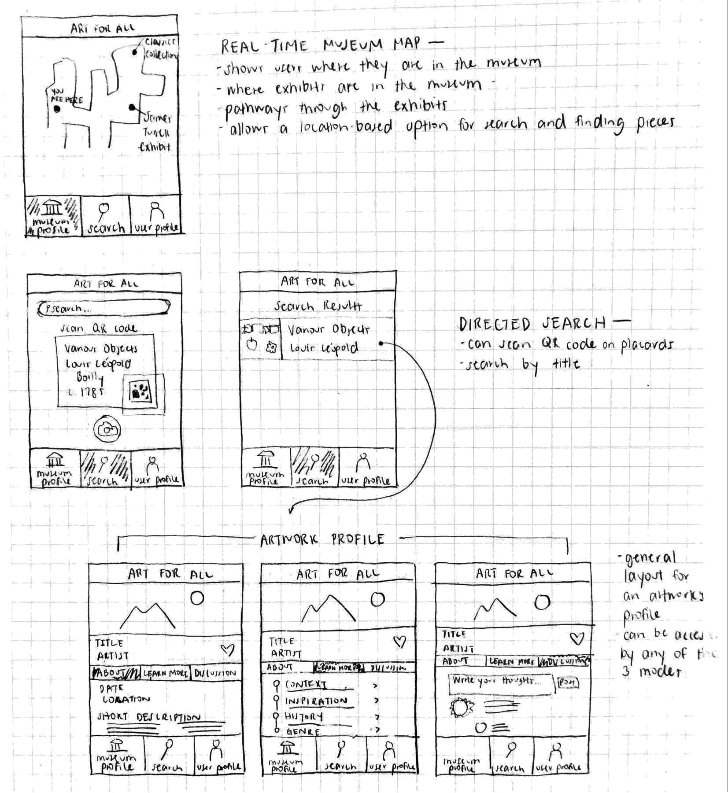
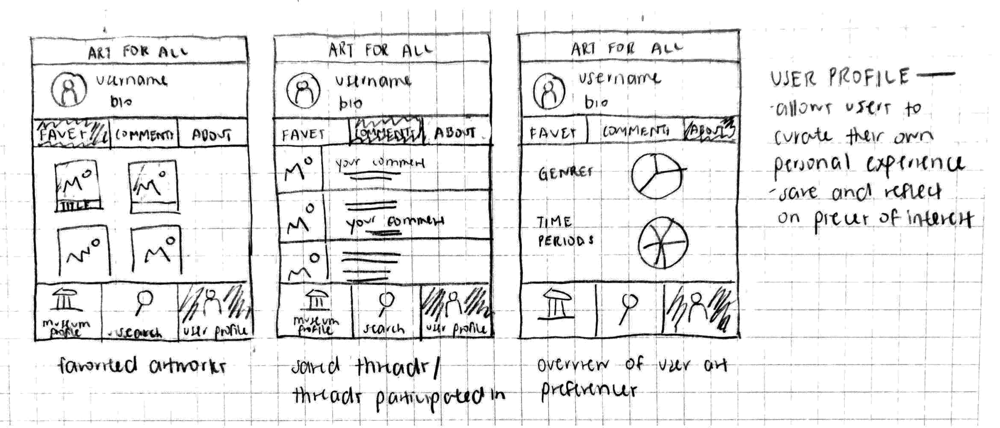

## Updated Design

We decided to combine parts of each of the first two designs in our final design. The second museum-centered design will serve as the basis for our app's structure. The motivation for this choice came from our contextual inquiries, because we realized that most people don’t actually look at or find art on their own; they come to museums for that purpose. We chose to keep the map from the second design because our contextual inquiries revealed that navigating effectively through museums and from one exhibit to the next can be a challenge for people. We also kept the QR codes featured in that design, because we noticed when visiting MASS MoCA that many modern exhibits these days aren’t just framed artworks, so they would be harder to detect by just snapping a picture. In addition, some exhibits don’t allow camera use inside, so the QR code could be placed just outside the exhibit with the wall text. From the first design, we wanted to keep the tabs that toggle between “About”, “Learn More” and “Discussion,” because we didn’t feel like there was a streamlined sequence of events for people when viewing an artwork (i.e. they didn’t first read the background, then ask questions, and then discuss the art; they often went back and forth). 

<figure>

<figcaption>Updated Design</figcaption>
</figure> 

## Selected Tasks

Our two selected tasks are finding background information about an artwork, and engaging in online discussions focused on specific artworks.
Finding background information is an activity that is central to the museum experience. We found during our contextual inquiries that all of the people we talked to came to the museum to learn about art, although some emphasized different aspects of that learning. In either case, we definitely wanted to highlight this learning aspect in our app.
For the discussion side, we mostly interviewed people who were already in groups, and we noticed how they enjoyed talking to each other about the art as they went along. The discussion task will thus allow for a wider conversation to take place with a more diverse set of people. In addition, people who find themselves visiting a museum alone will still get to discuss their experience with others. Art is a social experience. A museum-goer should not only be able to communicate with an artwork but with other museum-goers. This allows for cross pollination of ideas and different interpretations of art.

## Scenarios

### Scenario 1: Finding background information 

Ben is visiting his local art museum and comes across a piece that really strikes him. He wants to know more, so he pulls up the Art for All app and navigates to the search tab. He clicks on the camera button and scans a picture of the QR code on the artworks' panel. The app pulls up the artworks' profile, and he clicks on the Learn More tab. He wants to learn about the inspiration for the piece, so he clicks on the inspiration section and reads about the artists' inspiration for the work. When he has read as much info as he'd like to know, he closes the app and moves on to investigate more in the museum. See [Storyboard 1](../Storyboards).

### Scenario 2: Discussing Art

Bob has recently visited a museum and become entranced with a Jackson Pollock work. He is waiting for the bus, and thinks back to this piece. He decides he wants to discuss this particular artwork with others, so he pulls up the Art for All app and navigates to the discussion section under this artwork profile page. He asks some probing questions, and finds that another student, Sarah, is also online at the same time and wants to talk about this particular work. They discuss their interpretations, and in the end Bob feels like he has a better understanding of the artwork. See [Storyboard 2](../Storyboards).
