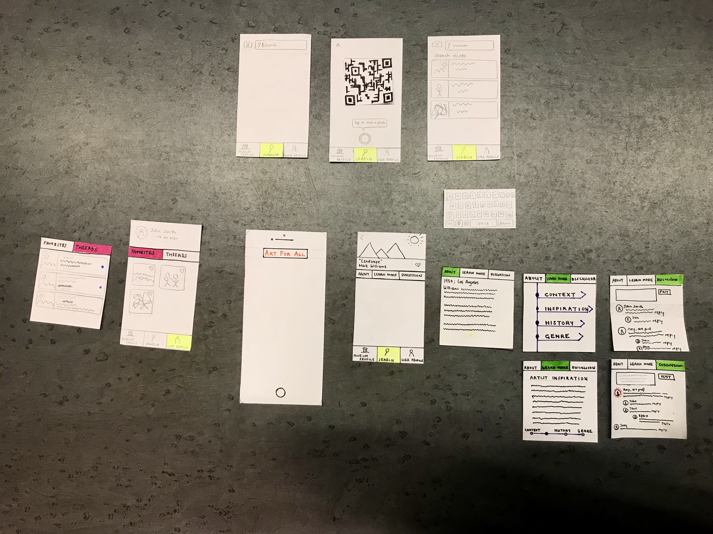

## Design
Art for All is a mobile application that allows users to learn more about the art pieces users see in museums

## Tasks
Learn more context and background information to better understand the meaning behind artworks
Discuss artwork with others in order further engage with the pieces

## Overview of paper prototyping

<figure>

<figcaption>Components of paper prototype</figcaption>
</figure>

The application has three primary modes: the museum profile, search, and user profile. The yellow highlighted box indicates which mode the user is in. Initially opening the application brings the user to the default Search mode page, as shown in Screen 1.1. From this page, users have the option between either a text search, as shown in Screens 1.2, 1.3, or a picture QR code search, as shown in Screens 1.4, 1.5, 1.6 Both lead to a results page, in Screen 1.7, where the desired artwork can be chosen.

<figure>

<figcaption>Searching artwork</figcaption>
</figure>

Clicking on the artwork opens a nested art profile page with “About” (Screen 2.1), “Learn More,” and “Discussion” tabs the user can toggle between to support the first task of discovering more context about artworks. The “Learn More” tab (Screen 2.3) contains drop-down menus of further background information, including “Context,” “Inspiration,” “History,” and “Genre” that can be collapsed and expanded, as shown in Screen 2.5.

<figure>

<figcaption>Artwork Profile</figcaption>
</figure>

<figure>

<figcaption>Artwork Profile (cont.)</figcaption>
</figure>

The “Discussion” tab (Screen 2.7) supports the task of discussing art with others. In this tab, users can post and reply to other users’ comments about this artwork, as shown in Screens 2.8-12.

<figure>

<figcaption>User Profile</figcaption>
</figure>

Clicking on the User Profile mode displays the initial Screen 3.1. The user profile displays a header containing a user profile picture, name, and bio. The body of the page consist of “Favorites” and “Threads” tabs that are toggled between. The “Favorites” tab displays favorited artworks. Clicking on any of these artworks, in Screen 3.2, brings the user to a nested art profile page, in Screen 3.3. The “Threads” tab (Screen 3.5) displays a list of discussions the user has participated in and highlights those with unread replies. Clicking on any of these comments, in Screen 3.6, opens a nested discussion page, as shown in Screen 3.7.
