## Overview of Final Paper Prototype

<figure>
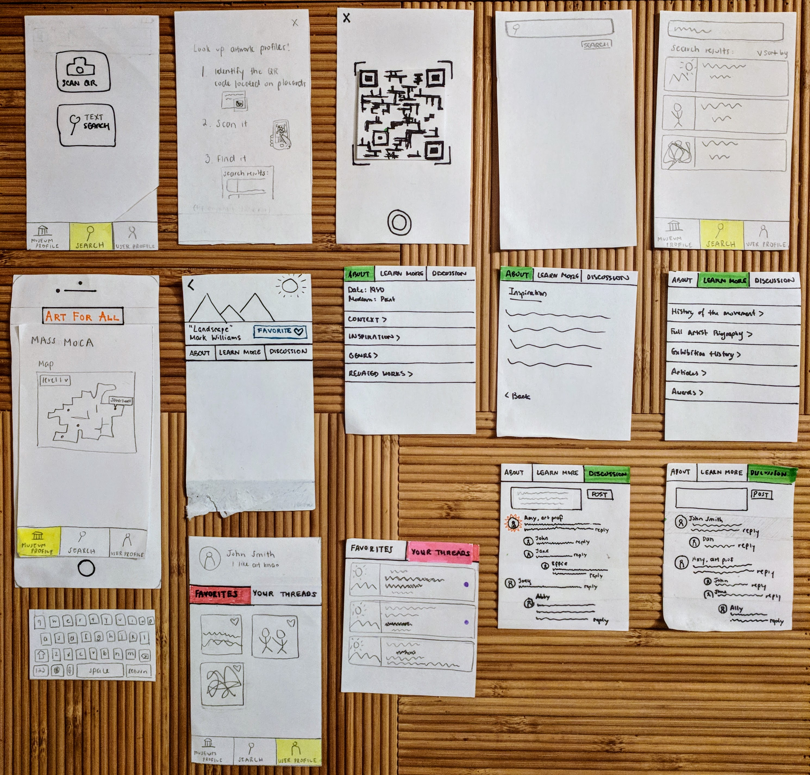
<figcaption>Final Paper Prototype</figcaption>
</figure>

Our final paper prototype integrates the changes we made from the feedback we received in our heuristic evaluations and usability tests. We added the “Favorite” text to the button users use to favorite pieces because some users found the simple heart image ambiguous. We changed the tab for “Threads” on the user profile to “Your Threads,” also to make the functionality less ambiguous. We added a one-time tutorial to the beginning of the QR search function to make it more clear, and added an outline on the camera screen to indicate where the QR code should go. We also added a new search screen so users could understand the difference between a QR search and a text search. We also added back buttons where there weren’t ones before, and removed the bottom bar of tabs where it wasn’t necessary. The use of the final paper prototype in our two tasks is outlined below.

## Task 1: Finding background information about artworks

<figure>
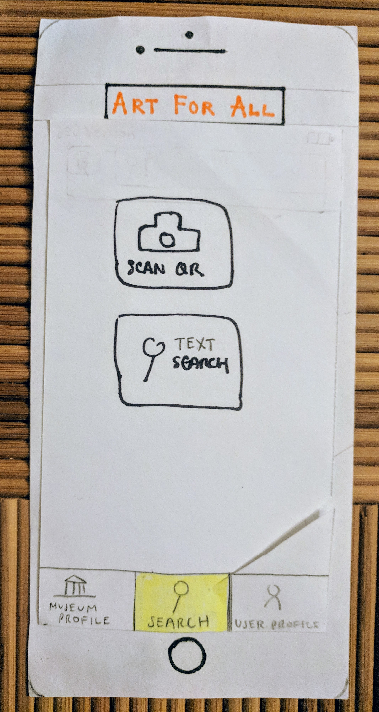
<figcaption>User begins in search menu</figcaption>
</figure>
<figure>
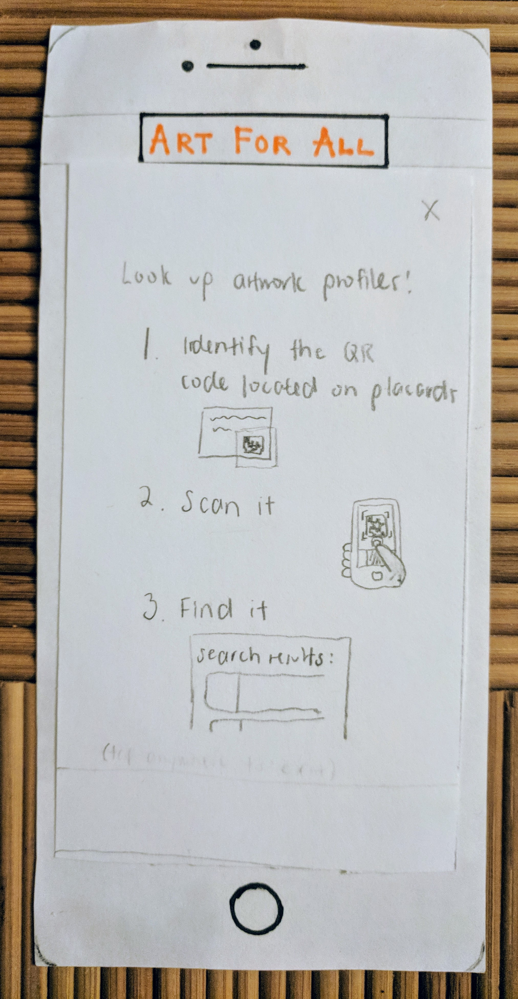
<figcaption>User chooses QR code scan, and is presented with a one-time tutorial on how to use the QR code scanning function</figcaption>
</figure>
<figure>
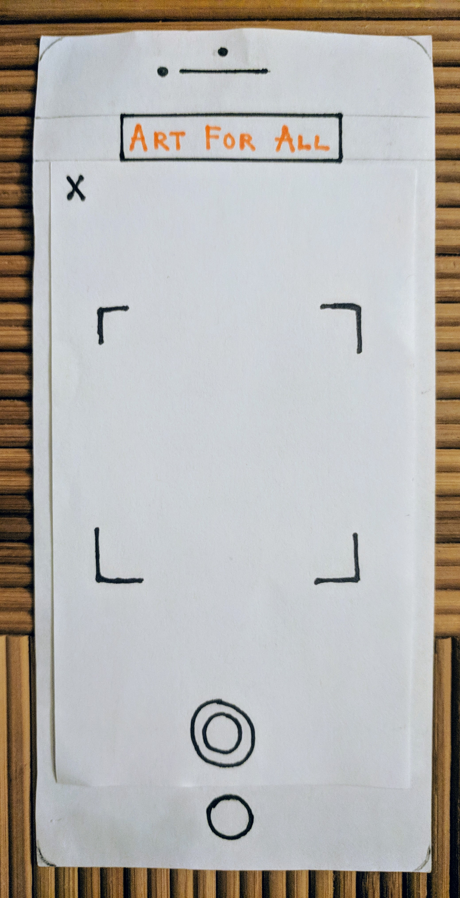
<figcaption>User clicks anywhere on the screen to get to the camera</figcaption>
</figure>
<figure>
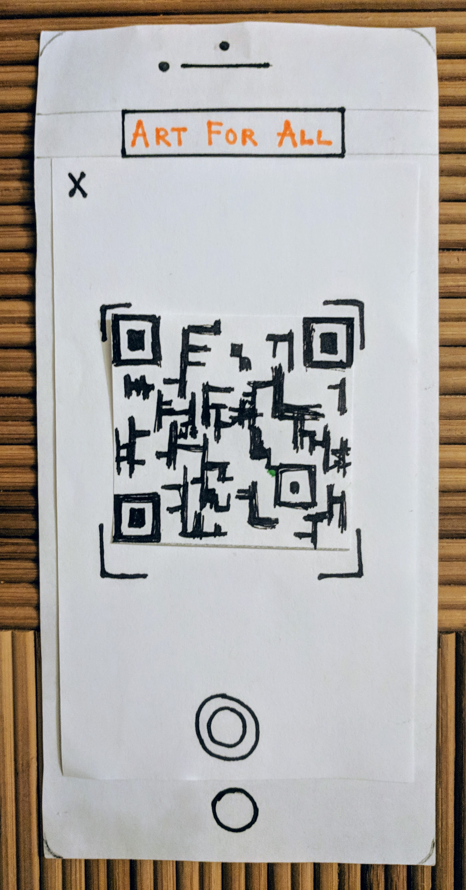
<figcaption>User scans QR code</figcaption>
</figure>
<figure>
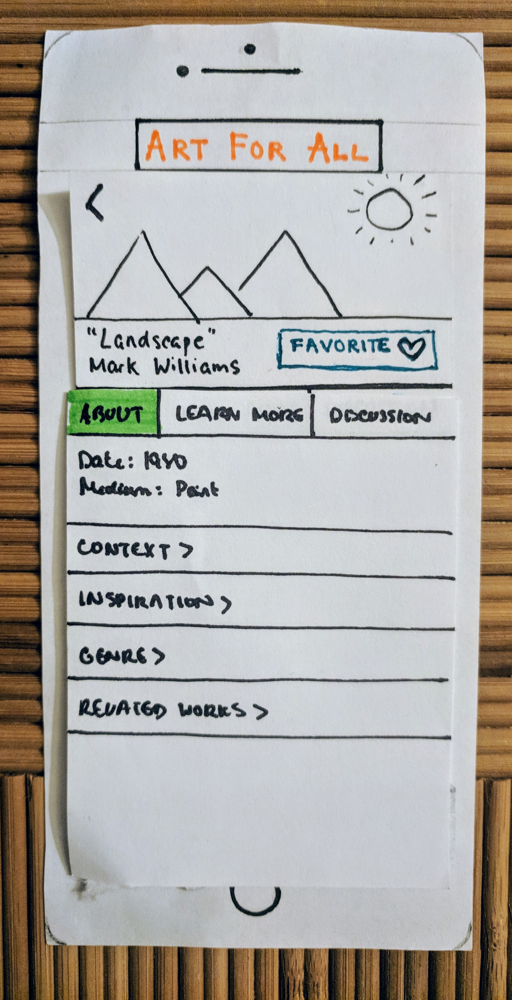
<figcaption>App scans QR and navigates to artwork profile, beginning in About section</figcaption>
</figure>
<figure>
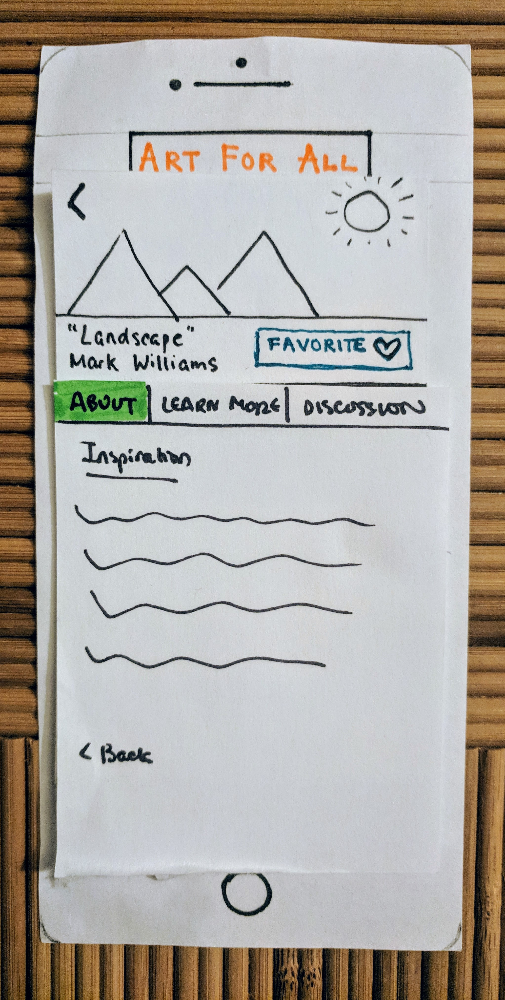
<figcaption>User clicks on inspiration</figcaption>
</figure>
<figure>
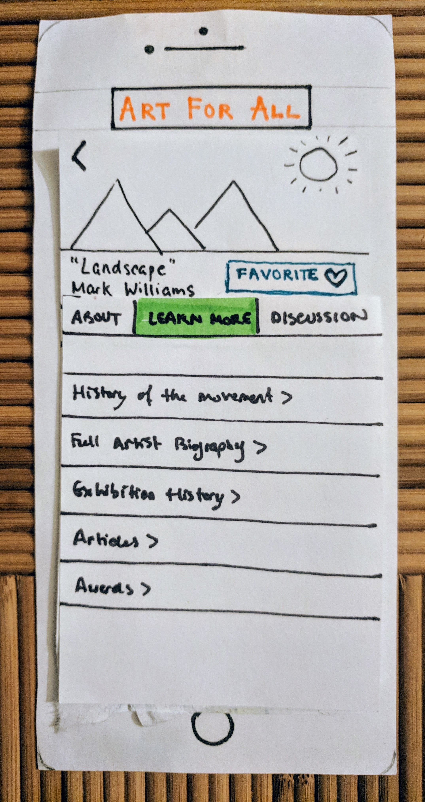
<figcaption>User clicks on Learn More</figcaption>
</figure>

## Task 2: Discussing art with others

<figure>

<figcaption>User begins on front page of artwork’s profile</figcaption>
</figure>
<figure>
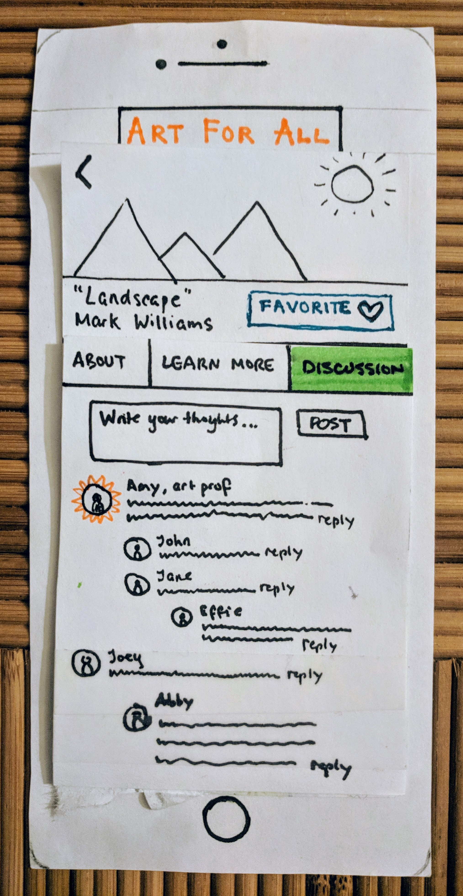
<figcaption>User clicks on Discussion</figcaption>
</figure>
<figure>
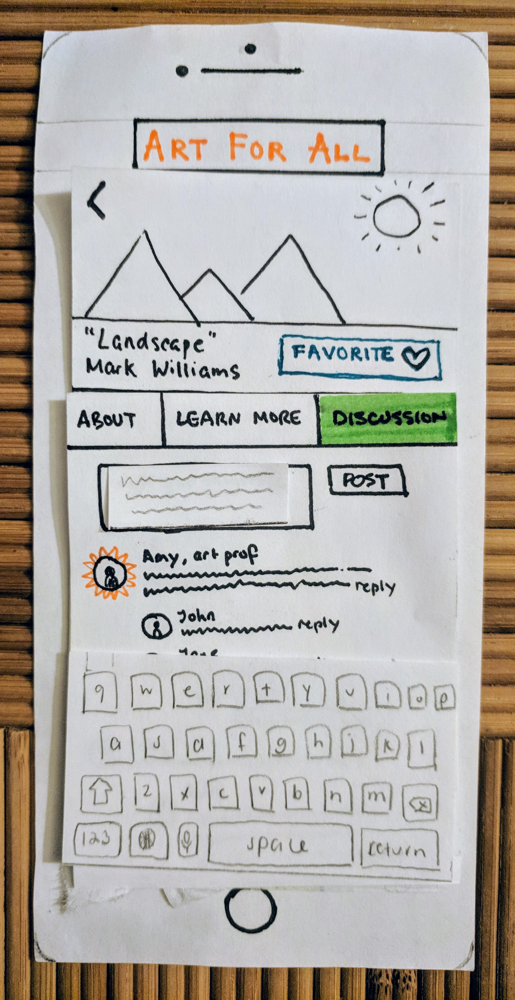
<figcaption>User clicks on the text field and types a comment</figcaption>
</figure>
<figure>
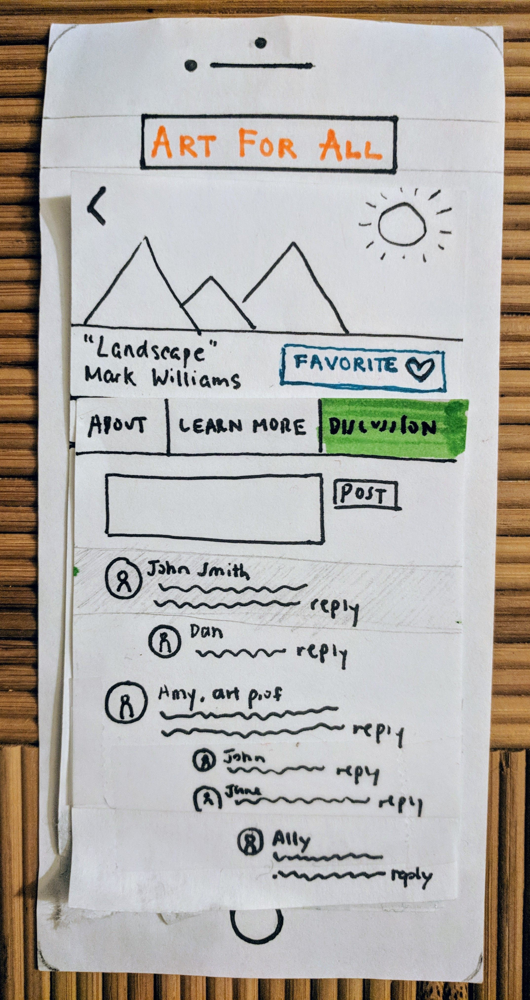
<figcaption>User submits comment, and it shows up at the top of the comments section</figcaption>
</figure>

### Some time later, user can check up on her threads and see if anyone has responded to her comments

<figure>
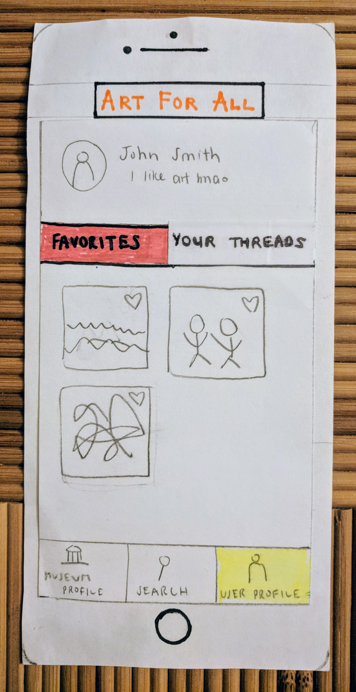
<figcaption>User navigates to user profile</figcaption>
</figure>
<figure>
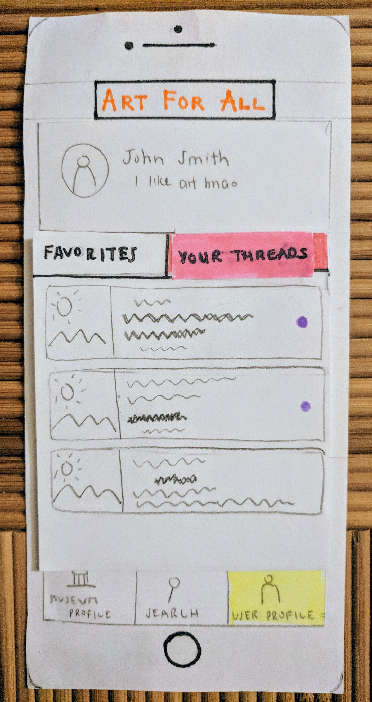
<figcaption>User clicks on “Your Threads,” and can check up on old threads from there.</figcaption>
</figure>

