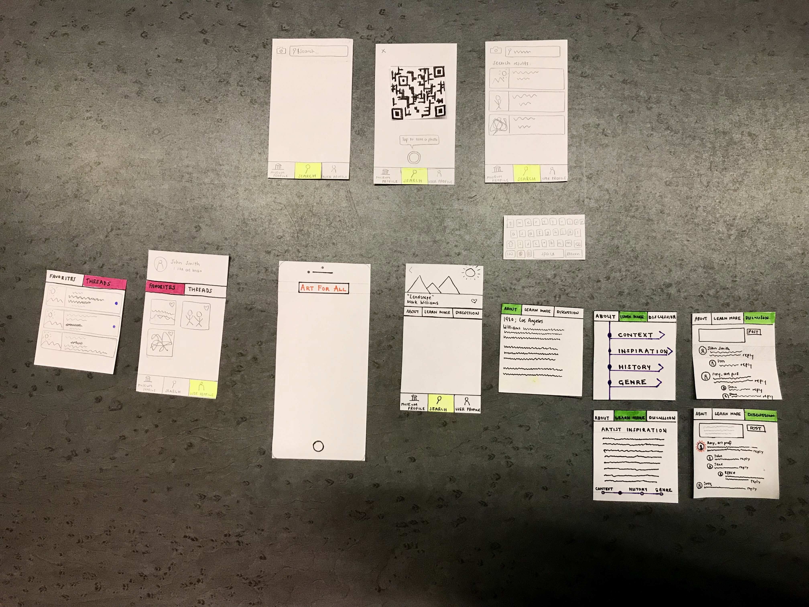

Stephanie and Joyce facilitated an heuristic evaluation performed by Karl on our paper prototype (and vice versa for Pin's prototype). His full evaluation is below.

<figure>

<figcaption>Karl's written evaluation</figcaption>
</figure>

Cliff facilitated an evaluation performed by Alyssa and Lester (and vice versa for Pin's prototype). Their full evaluations are below. 

<figure>

<figcaption>Alyssa's written evaluation</figcaption>
</figure>

<figure>

<figcaption>Lester's written evaluation</figcaption>
</figure>

An overview image of the paper prototype we used for evaluation is also shown below.

<figure>

<figcaption>Components of paper prototype</figcaption>
</figure>

To see the evaluations we performed on Pin's paper prototype, please refer to Pin's project page. 
