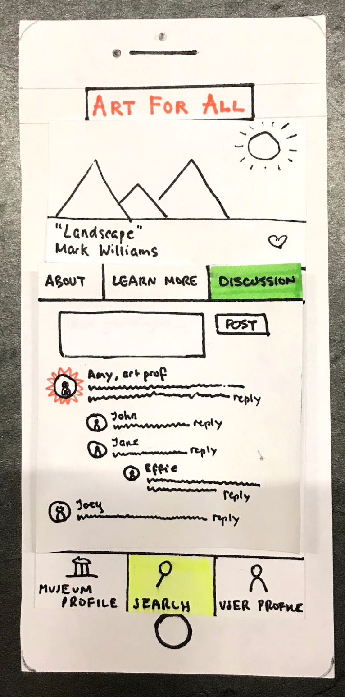
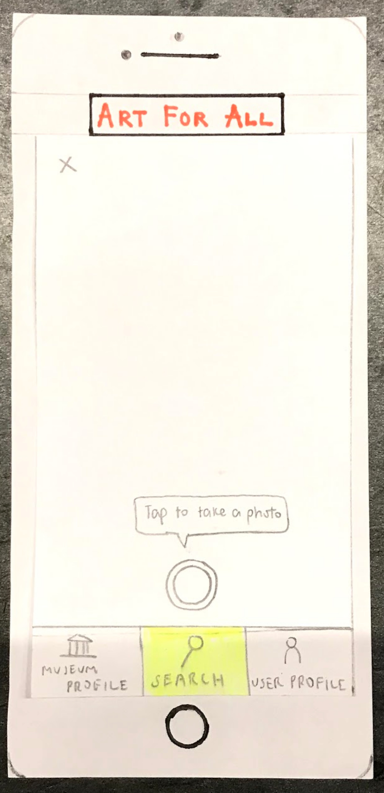

# Heuristic Evaluation

Our group received two heuristic evaluations from two different groups. The evaluation was carried out according to Nielsen’s heuristics sheet. The evaluators identified potential issues with our design, noted the heuristic violated, and assigned a severity score. For detailed images of the evaluator’s comments, refer to the [Heuristic Evaluations page](../heuristic-evaluations)

## List of issues and modifications:

### 1. Functionality of Camera Icon is Unclear

<figure>

<figcaption>Search menu</figcaption>
</figure>

We received feedback that a primary function of our application, which allows the user to scan a QR code using the mobile phone’s camera, was not clear. The camera icon was too close to the search bar, and the camera did not provide any indication that it would be used to scan QR codes.

**Heuristic Violated:** This issue violates the visibility of system heuristic. Providing more clarity on the different functions of the search bar and the camera icon, through labeling and separation of the two components, will provide better context for the user.

**Severity Rating:** 3

**Revision:**

<figure>

<figcaption>Two separated components with clear labeling</figcaption>
</figure>

### 2. Missing Back Button(s)

<figure>

<figcaption>Inspiration section of “Learn more” </figcaption>
</figure>

Our evaluators pointed out that after navigating to inspiration, it was unclear how to get back to the main about section. They felt stuck.

**Heuristic Violated:**  User Control and freedom. Our design did not have a clearly market “emergency exit” there.  We added in a back button.

**Severity Rating:** 1

**Revisions:**

<figure>

<figcaption>Back button added</figcaption>
</figure>

### 3.  Redundancy 

<figure>

<figcaption>Camera screen</figcaption>
</figure>
<figure>

<figcaption>Discussion screen</figcaption>
</figure>

Some of our screen components, like the bottom toolbar, felt redundant to our evaluators in certain contexts. This added clutter and made the design difficult to navigate.

**Heuristic Violated:** Aesthetics and minimalist design. The design should only provide information that is needed and is helpful to the user. We decided to drop the bottom bar wherever it was easy for the user to still go back one page and find the bottom bar easily should they need it. 

**Severity Rating:** 2

**Revisions:**

<figure>

<figcaption>Camera screen removes toolbar</figcaption>
</figure>
<figure>

<figcaption>Discussion screen removes toolbar</figcaption>
</figure>

### 4. Lack of Feedback

<figure>

<figcaption>Favorites section</figcaption>
</figure>

One of the evaluators liked the feature that allowed users to favorite paintings. However, it was not clear to them how and where the favored artworks were stored within the application. 

**Heuristic Violated:** Match between system and real world. While our application stored the artworks favorited by the user, it did not provide enough feedback to the user. People expect an action to have a visible reaction. However, we have decided to not make the user profile section our focus right now.

**Severity Rank:** 1

# Usability Test Results

We conducted the first usability test with Hussain Bukhari, a senior at Williams, in a study room in Sawyer Library. We chose to start with Hussain because he is not an art history major but has taken four art history classes at Williams and has a deep appreciation for art, so he sits in the middle in terms of art education. We followed the test protocol outlined in Kathleen Gomoll’s “Some Techniques for Observing Users,” starting with a brief explanation of the app and the format and rules for the usability test. We explained each of our two main tasks in a scenario format for the user, and asked him to carry out those tasks while explaining his thought process and ask questions (even if we couldn’t answer them). Stephanie facilitated the usability test, and Joyce took notes. A major challenge we encountered while facilitating the usability test was “the user with an agenda,” as Carolyn Snyder describes it in “Paper Prototyping.” I believe there are several reasons for why our participant believed he was being asked his opinion on the app’s interface and to describe what he liked and disliked. For one, I think we can be more clear going forward with regards to establishing what the purpose of the usability test is. We may have underestimated the possibility of this happening. I also believe the fact that the user was easily able to understand the app’s functionality meant he ended up sort of looking for other things to talk about or comment on. We also did not write out the tasks this time, and I think going forward it will be helpful to print out the tasks so that the user can see very explicitly what his direction is. 

## Critical Incidents

### “About” vs “Learn More”

<figure>

<figcaption>About screen under artwork profile</figcaption>
</figure>
<figure>

<figcaption>Learn More screen under artwork profile</figcaption>
</figure>

**Incident:** While trying to navigate to a page that contained the inspiration for an artwork, we realized that it wasn’t clear to a general user whether the inspiration information should be under “about” or “learn more.” This led us to believe we may want to put more information about the inspiration and context under the “about” tab, and leave very in-depth understanding to the “learn more” section (e.g. further information about the artist and the history of the movement). 

**Severity Level:** 3 (This is one of the main tasks our app is trying to support).

**Revision:** Modifying the “Learn More” section to be a series of very in-depth information and having the "About" page contain information that used to be in the "Learn More" section.

<figure>

<figcaption>New About Page</figcaption>
</figure>

<figure>

<figcaption>New Learn More Page</figcaption>
</figure>

### QR Code Scanner

<figure>

<figcaption>QR Scanner</figcaption>
</figure>

**Incident:** While trying to “fake” taking a scan of the QR code, our user noted that he didn’t really know where to put the QR code, and that it would be nice to have a box on the camera screen so the user knows exactly where to put it. 

**Severity Level:** 1

**Revision:** Simply adding a box/grid layout to make it easier for the user.

<figure>

<figcaption>Updated QR code screen</figcaption>
</figure>

### Discussion

<figure>

<figcaption>Discussion</figcaption>
</figure>

**Incident:** This was a positive incident; our user was quickly and easily able to locate the “discussion” section and understand the gist of the interface and how it would operate. This is likely because discussions like this exist in similar formats on other platforms. 

## Updated Design

<figure>

<figcaption>Overview of Revised Prototype</figcaption>
</figure>

### Task 1: Finding background information

<figure>

<figcaption>User begins in search function</figcaption>
</figure>
<figure>

<figcaption>User chooses QR code scan</figcaption>
</figure>
<figure>

<figcaption>User scans QR code</figcaption>
</figure>
<figure>

<figcaption>App scans QR and navigates to artwork profile, beginning in About section</figcaption>
</figure>
<figure>

<figcaption>User clicks on inspiration</figcaption>
</figure>
<figure>

<figcaption>User clicks on Learn More</figcaption>
</figure>

### Task 2: Discussing art with others

<figure>

<figcaption>User begins on front page of artwork’s profile</figcaption>
</figure>
<figure>

<figcaption>User clicks on Discussion and writes a brief comment</figcaption>
</figure>
<figure>

<figcaption>User submits comment, and it shows up at the top of the comments section</figcaption>
</figure>

## Going Forward

For our next usability tests, we may try to recruit an older person, although this will admittedly be much harder to do. Professors are generally busy, and we don’t know many older members of the community. If we cannot find an older user, we will still try to recruit people from different demographic backgrounds. We will try to recruit at least one user who is very well-versed in art history and art, and one who is not very interested in art and only consumes art through museums. We will try to rotate roles for the remaining tests so that everyone gets a chance at trying out each role. We have already mentioned some things we will try to change for upcoming usability tests, with the major one being establishing very up front that we are not exactly looking for the participant’s opinion on our interfaces during usability testing. We will also print out instructions for the tasks going forward. 

