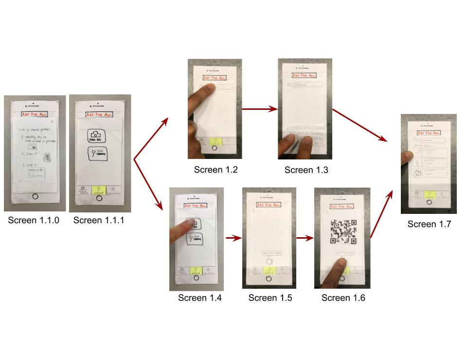
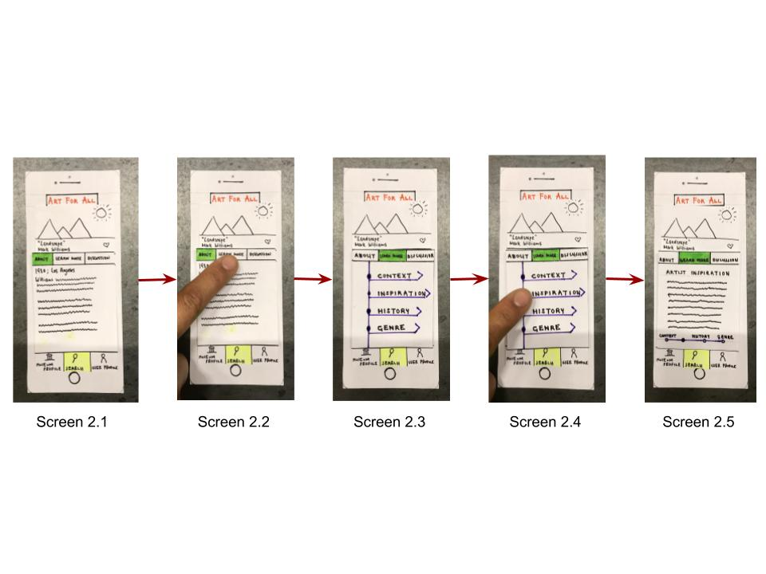
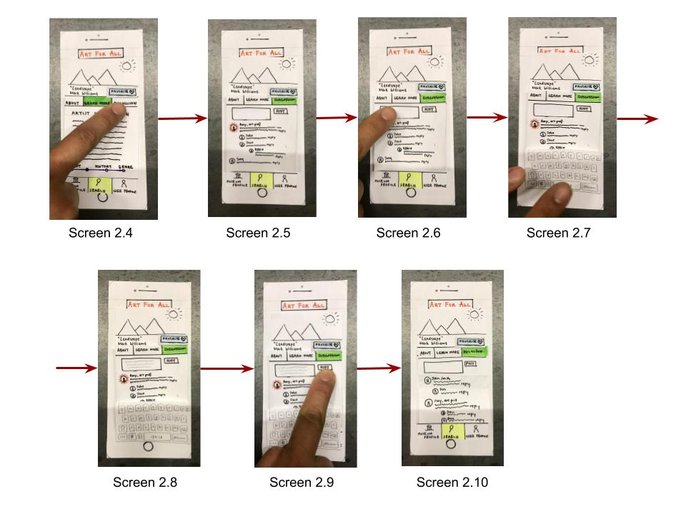
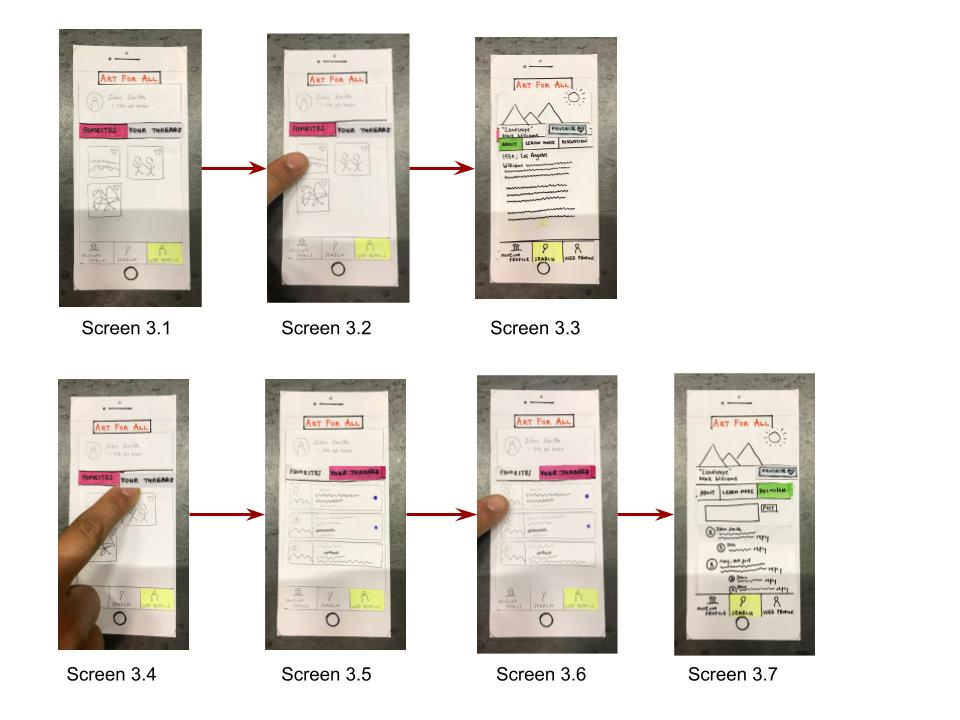

# Usability Test Overviews

## Usability Test #1
We conducted the first usability test with Hussain Bukhari, a senior at Williams, in a study room in Sawyer Library. We chose to start with Hussain because he is not an art history major but has taken four art history classes at Williams and has a deep appreciation for art, so he sits in the middle in terms of art education. We followed the test protocol outlined in Kathleen Gomoll’s “Some Techniques for Observing Users,” starting with a brief explanation of the app and the format and rules for the usability test. (We followed the same protocol for the following two usability tests as well). We explained each of our two main tasks in a scenario format for the user, and asked him to carry out those tasks while explaining his thought process and asking questions (even if we couldn’t answer them). Stephanie facilitated the usability test, and Joyce took notes.

## Usability Test #2
Our second usability test participant was Liam Bardong, who was also an interview subject during the contextual inquiry research. We chose Liam because he is familiar with the purpose of the app and its use case. We started the tests by laying out brief scenarios on paper of being in the museum and approaching a painting. We modified this and the following test compared to the first test by writing these scenarios down on paper and giving them to our participant to read out loud and refer to throughout the test. This test was conducted in Sawyer Library, a quiet space. Cliff conducted the test, and Joyce took notes.

## Usability Test #3
Our third usability test participant was Elizabeth Sullivan. We chose Elizabeth because she expressed interest in the app, as she does find herself not understanding some of the pieces she sees in art museums. She has taken a few art history courses and so is not unfamiliar with the subject matter. Because she did not know anything about the project, we prefaced the test by giving a same scenario explaining that the app was meant to learn more about art pieces. However, we chose not to communicate the specifics goals in order to compare how users interact with design without clearly defined goals. The test was also conducted in Sawyer. Joyce conducted the test, and Stephanie took notes.

# Critical Incidents and Revisions

## “About” vs “Learn More”

<figure>

<figcaption>About screen under artwork profile</figcaption>
</figure>
<figure>

<figcaption>Learn More screen under artwork profile</figcaption>
</figure>

**Incident:** While trying to navigate to a page that contained the inspiration for an artwork, we realized that it wasn’t clear to a general user whether the inspiration information should be under “about” or “learn more.” This led us to believe we may want to put more information about the inspiration and context under the “about” tab, and leave very in-depth understanding to the “learn more” section (e.g. further information about the artist and the history of the movement). 

**Severity Level:** 3 (This is one of the main tasks our app is trying to support).

**Revision:** Modifying the “Learn More” section to be a series of very in-depth information. 

<figure>

<figcaption>New About Page</figcaption>
</figure>

<figure>

<figcaption>New Learn More Page</figcaption>
</figure>

## QR Code Scanner

<figure>

<figcaption>QR Scanner</figcaption>
</figure>

**Incident:** While trying to “fake” taking a scan of the QR code, our user noted that he didn’t really know where to put the QR code, and that it would be nice to have a box on the camera screen so the user knows exactly where to put it. 

**Severity Level:** 1

**Revision:** Simply adding a box/grid layout to make it easier for the user.

<figure>

<figcaption>Updated QR code screen</figcaption>
</figure>

## Discussion

<figure>

<figcaption>Discussion</figcaption>
</figure>

**Incident:** This was a positive incident; our user was quickly and easily able to locate the “discussion” section and understand the gist of the interface and how it would operate. This is likely because discussions like this exist in similar formats on other platforms. 

## Favoriting
<figure>

<figcaption>Old favorite button</figcaption>
</figure>

**Incident:** Favoriting and adding artworks to the user’s profile was not readily apparent. Although Liam was able to discover this feature after exploring the application and browsing his user profile, the discovery was only in hindsight after he had already left the artwork profile screen. This incident was negative. Because favoriting artworks is one of our six primary tasks and the main feature of the user profile, this feature needed to be made more obvious.

**Severity Level:** 4

**Revisions:** Our solution was to change the favorite button into a more visible “like” button right underneath the work’s title. The action of “favoriting” can be made even more obvious with an animation of a picture disappearing into the profile tab.

<figure>

<figcaption>New favorite button</figcaption>
</figure>

## Museum Profile

**Incident:** Upon opening the application and being shown the initial screen for the “Search mode,” Elizabeth, like Liam, first went to the “Museum Profile” for the purposes of initially exploring the application. This incident was negative, as the order of interaction was not intuitive to our test users. Starting with this mode may be more ideal; it places the app within the user’s settings by communicating that the app is museum-specific and clearly defining what artwork is covered. Although not directly part of a primary task, the museum profile orients the user toward accomplishing the task of searching art pieces.

**Severity Level:** 4

**Revisions:** Creating a "Launch Screen" that will make more sense to the user.

<figure>

<figcaption>Launch screen</figcaption>
</figure>

## User Vocabulary
<figure>

<figcaption>Old search syntax</figcaption>
</figure>

<figure>

<figcaption>Old thread syntax</figcaption>
</figure>

**Incident:** Some of the syntax employed resulted in negative incidents, as they did not successfully translate their ascribed functionality. In particular, at the search page, Elizabeth didn’t understand the difference between being in the “Search” mode and the button option to “Search.” Additionally, she did not recognize that the “Threads” section of the User Profile would display the threads she participated in. 

**Severity Level:** 1

**Revisions:** Changing these words so that they better suit the user’s vocabulary to increase the usability of these key interactions. 

<figure>

<figcaption>New search syntax</figcaption>
</figure>

<figure>

<figcaption>New thread syntax</figcaption>
</figure>

## QR Code Search Tutorial
<figure>

<figcaption>Old initial search screen</figcaption>
</figure>

**Incident:** Both Liam and Elizabeth did not understand the capability to scan QR codes, which was another negative incident. However, once this feature of being able to scan the QR codes displayed on artwork placards was explained to them, both preferred to use this over the text search.

**Severity Level:** 2

**Revisions:** To solve this problem of not allowing users to easily look up artworks, upon launching the “Search” mode for the first time, a tutorial overlay page outlines the QR code look-up process for the user.

<figure>

<figcaption>New initial search screen</figcaption>
</figure>

# Overview of Revised Prototype
<figure>

<figcaption>Revised paper prototype overview</figcaption>
</figure>

The application has three primary modes: the museum profile, search, and user profile. The yellow highlighted box indicates which mode the user is in. Initially opening the application brings the user to the Museum profile mode page, as shown below.

<figure>

<figcaption>Launch screen</figcaption>
</figure>

# Primary Tasks

## Task 1: Learn more context and background information to better understand the meaning behind artworks

From the launch page, users can start their search. Opening the Search mode for the first time prompts a tutorial, as shown in Screen 1.1.0, detailing how to look up an image using a QR code. In Screen 1.1.1, users can then choose between a text (Screens 1.2-1.3) or QR search (Screens 1.4-1.6). Both lead to a results page, in Screen 1.7, where the desired artwork can be chosen.

<figure>

<figcaption>Revised search</figcaption>
</figure>

Clicking on the artwork opens a nested art profile page with “About,” “Learn More,” and “Discussion” tabs the user can toggle between to support the first task of discovering more context about artworks. The “About” tab contains drop-down menus of further background information, including “Context,” “Inspiration,” “Genre,” and “Related Works” that can be collapsed and expanded, as shown in Screen 2.2-2.3.

<figure>

<figcaption>Art profile</figcaption>
</figure>

## Task 2: Discuss artwork with others in order to further engage with the pieces
<figure>

<figcaption>Art profile (cont.)</figcaption>
</figure>

The “Discussion” tab (Screen 2.6) supports the task of discussing art with others. In this tab, users can post and reply to other users’ comments about this artwork, as shown in Screens 2.7-10.

<figure>

<figcaption>User profile</figcaption>
</figure>

Clicking on the User Profile mode displays the initial Screen 3.1. The user profile displays a header containing a user profile picture, name, and bio. The body of the page consist of “Favorites” and “Threads” tabs. The “Favorites” tab displays favorited artworks. Clicking on any of these artworks, in Screen 3.2, brings the user to a nested art profile page, in Screen 3.3. The “Threads” tab (Screen 3.5) displays a list of discussions the user has participated in and highlights those with unread replies. Clicking on any of these comments, in Screen 3.6, opens a nested discussion page, as shown in Screen 3.7.

# Key Revisions

One of the key revisions we made was the search functionality. First, we added in clear and large buttons to delineate the difference between the text search and the QR search. Then we added more explicit text so that the users could distinguish between the kinds of search and understand why they were different. Lastly, we added in a one-time tutorial of how the QR search functionality would work. All of these changes helped make the search function much clearer and improve the usability. Since searching for the artwork to pull up its artwork profile is a key functionality of our design, this was very important to us to change. Another key revision was changing how the "About" and "Learn More" pages were divided, and we found that after the first usability test, we needed to make this distinction more intuitive. We decided to modify what kinds of information would be located under each tab. We noticed in our second and third usability tests, this distinction was a lot more clear to our users, and they had no problem finding what they needed with this modification. Thus, we found this change to be incredibly important for our design and usability. Obviously, since finding background information is a key task we are trying to support, making it as easy as possible for the user to find the background information they are explicitly looking for is important to us.
