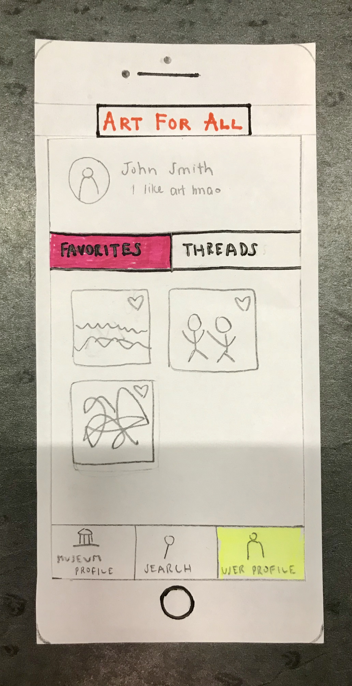

## Usability Test #2
Our second usability test participant was Liam Bardong, who was also an interview subject during the contextual inquiry research. We chose Liam because he is familiar with the purpose of the app and its use case. We started the test by laying out a brief scenario of being in the museum and approaching a painting, for which he didn’t really understand. This test was conducted in Sawyer Library, a quiet space. Cliff conducted the test, and Joyce took notes.

## Usability Test #3
Our third usability test participant was Elizabeth Sullivan. We chose Elizabeth because she expressed interest in the app, as she does find herself not understanding some of the pieces she sees in art museums. She has taken a few art history courses and so is not unfamiliar with the subject matter. Because she did not know anything about the project, we prefaced the test by giving a same scenario explaining that the app was meant to learn more about art pieces. However, we chose not to communicate the specifics goals in order to compare how users interact with design without clearly defined goals. The test was also conducted in Sawyer. Joyce conducted the test, and Stephanie took notes.

## Revisions
## Favoriting
Favoriting and adding artworks to the user’s profile was not readily apparent. Although Liam was able to discover this feature after exploring the application and browsing his user profile, the discovery was only in hindsight after he had already left the artwork profile screen. This incident was negative. Because favoriting artworks is one of our six primary tasks and the main feature of the user profile, this feature needed to be made more obvious.
Severity: 4

Our solution was to change the favorite button into a more visible “like” button right underneath the work’s title. The action of “favoriting” can be made even more obvious with an animation of a picture disappearing into the profile tab.

[Insert images : favorite-updated1 and favorite-updated2] & [image before updating favorite button]

## Museum Profile
Upon opening the application and being shown the initial screen for the “Search mode,” Elizabeth, like Liam, first went to the “Museum Profile” for the purposes of initially exploring the application. This incident was negative, as the order of interaction was not intuitive to our test users. Starting with this mode may be more ideal; it places the app within the user’s settings by communicating that the app is museum-specific and clearly defining what artwork is covered. Although not directly part of a primary task, the museum profile orients the user toward accomplishing the task of searching art pieces.
Severity: 4

## User Vocabulary
Some of the syntax employed resulted in negative incidents, as they did not successfully translate their ascribed functionality. In particular, at the search page, Elizabeth didn’t understand the difference between being in the “Search” mode and the button option to “Search.” Additionally, she did not recognize that the “Threads” section of the User Profile would display the threads she participated in. Changing these words to that which better suits the user’s vocabulary increases the usability of these key interactions. 
Severity: 1

<figure>

<figcaption>Old search syntax</figcaption>
</figure>

<figure>

<figcaption>New search syntax</figcaption>
</figure>

<figure>

<figcaption>Old thread syntax</figcaption>
</figure>

<figure>

<figcaption>New thread syntax</figcaption>
</figure>

## QR Code Search Tutorial
Both Liam and Elizabeth did not understand the capability to scan QR codes, which was another negative incident. However, once this feature of being able to scan the QR codes displayed on artwork placards was explained to them, both preferred to use this over the text search.
Severity: 2

<figure>

<figcaption>Old initial search screen</figcaption>
</figure>

To solve this problem of not allowing users to easily look up artworks, upon launching the “Search” mode for the first time, a tutorial overlay page outlines the QR code look-up process for the user.

<figure>

<figcaption>New initial search screen</figcaption>
</figure>
