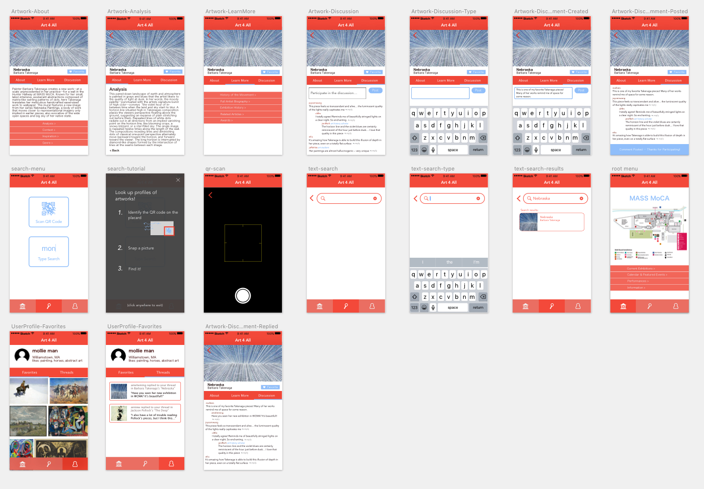
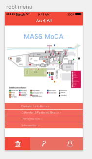
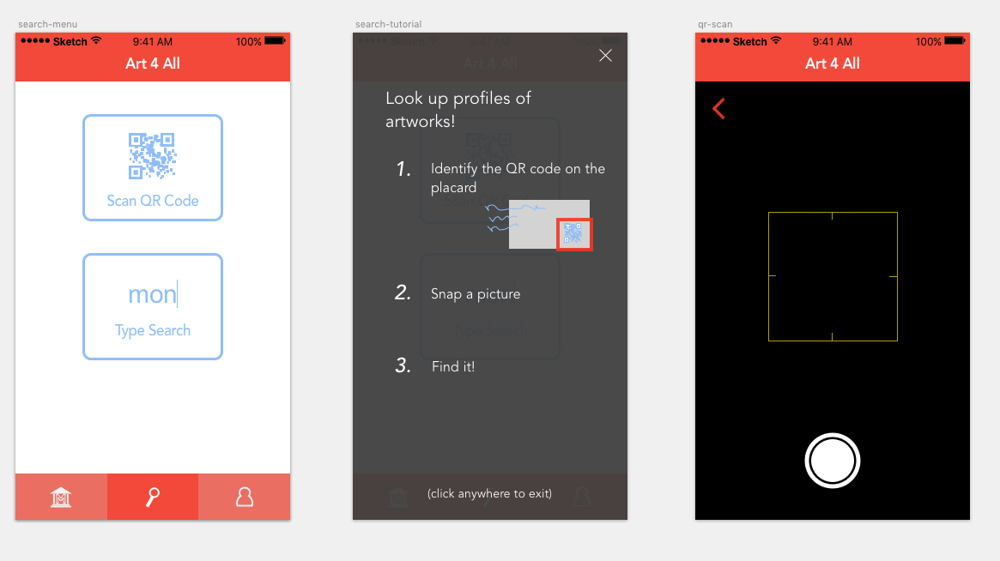
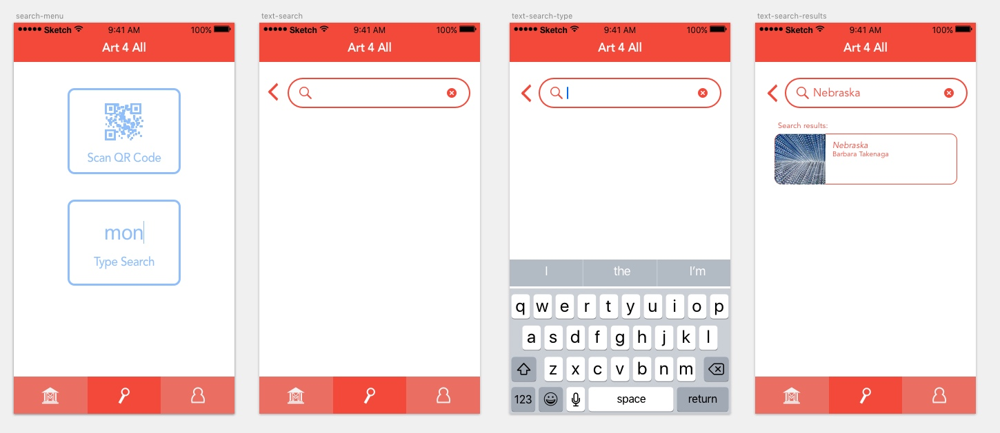
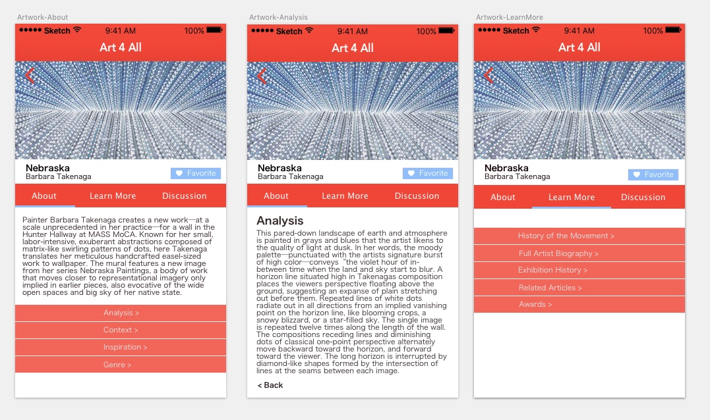
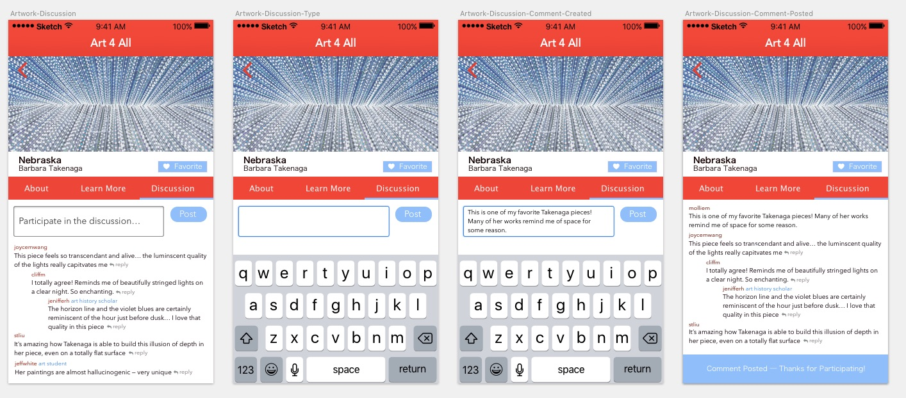
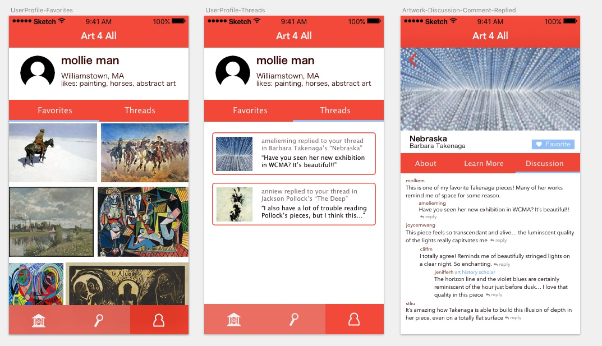

## Overview of Digital Mock-Up

<figure>

<figcaption>Digital Mock-Up</figcaption>
</figure>

<figure>

<figcaption>Launch screen that provides information about the museum and the museum map to navigate exhibits.</figcaption>
</figure>

## Task 1: Learning Background Information about Artworks

<figure>

<figcaption>From the launch page, the user can choose the "Search" tab in the bottom navigation bar. This pulls up the choice between a QR search and a Text Search. If the user chooses the QR search function, then the user will be presented with a one-time tutorial on how to use this functionality. A camera is then presented for the user to scan the appropriate QR code.</figcaption>
</figure>

<figure>

<figcaption>Alternatively, the user may choose to search by text. In this case, a list of search results will load continuously as the user types in key search words. </figcaption>
</figure>

<figure>

<figcaption>Once the user finds the artwork she is looking for, she may click on the artwork to take her to the artwork profile. From the artwork profile, the user can tab between "About" and "Learn More," and investigate the information under each. Shown here is the "Analysis" portion of the "About" page.</figcaption>
</figure>

## Task 2: Participating in Discussions about Art with Other Users

<figure>

<figcaption>The artwork profile also contains a "Discussion" tab. The user can read through others' comments, reply to threads, or start new threads. There are different labels signifying which users have a scholarly background in art. In this scenario, the user decides to write a new comment to join the discussion.</figcaption>
</figure>

<figure>

<figcaption>When the user navigates to the user profile, he can see all the threads he has notifications in. In this case, someone has responded to his previous comment. The user can then click on that notification, and will be taken to the discussion section of the artwork. The user can then choose to respond to that new comment. </figcaption>
</figure>

## Revisions

We actually found that we were able to keep many of the components of our paper prototype the same when moving to a digital mock-up. One change that stands out is that we decided to get rid of icons in the discussion sections. Since mobile platforms have so little space to begin with, we decided it wasn't worth including icons, and they wouldn't add much to the discussion experience. We also modified the QR code scanning button to be a picture of a QR code rather than a camera, as we thought that might be more indicative of its use. 
