## Heuristic Evaluations
The heuristic evaluations demonstrated the following major problems and consequent revisions:

## 1. Unclear initial search page
### Before:
The functionality of the camera icon of the Search page was unclear, as users didn’t know that the camera was meant to scan QR codes.
<figure>
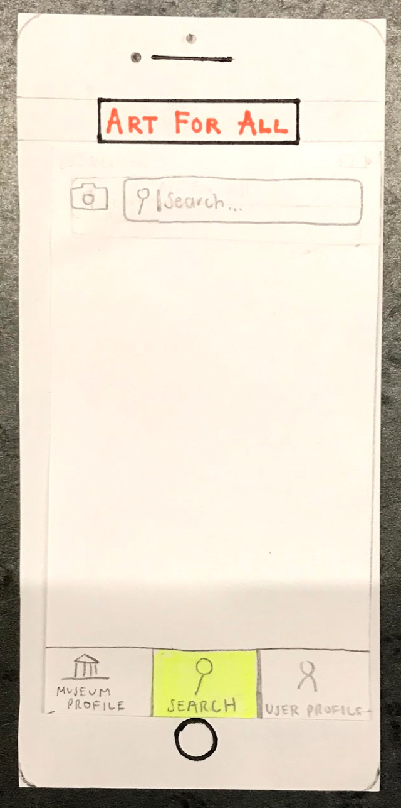
<figcaption>Search menu</figcaption>
</figure>

### After:  
To clarify the two search options and provide more context on functionality, we labelled and separated the two components in a large button menu.
<figure>
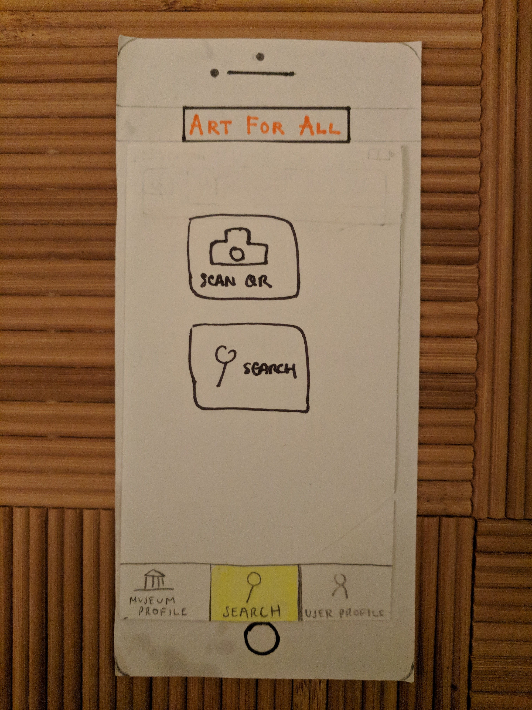
<figcaption>Two separated components with clear labeling</figcaption>
</figure>

## 2. Missing back button(s)
### Before:
After navigating to inspiration, it was unclear how to get back to the main About section.
<figure>
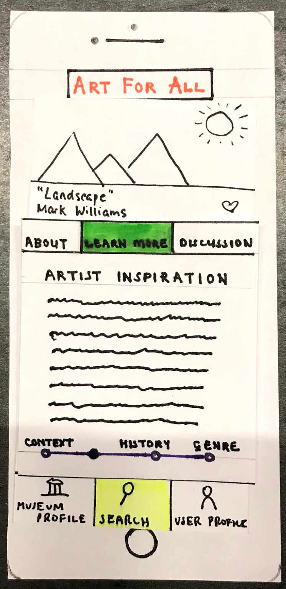
<figcaption>Inspiration section of "Learn more" </figcaption>
</figure>

### After:
Revision: A back button was added.
<figure>
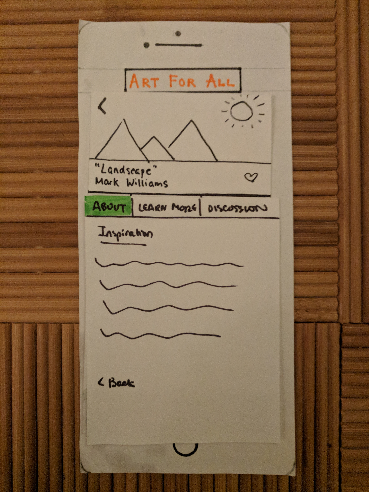
<figcaption>Back button added</figcaption>
</figure>

## 3. Unnecessary screen components
### Before: 
Always having the bottom toolbar felt redundant to evaluators in certain contexts. This added clutter and made the design difficult to navigate. 
<figure>
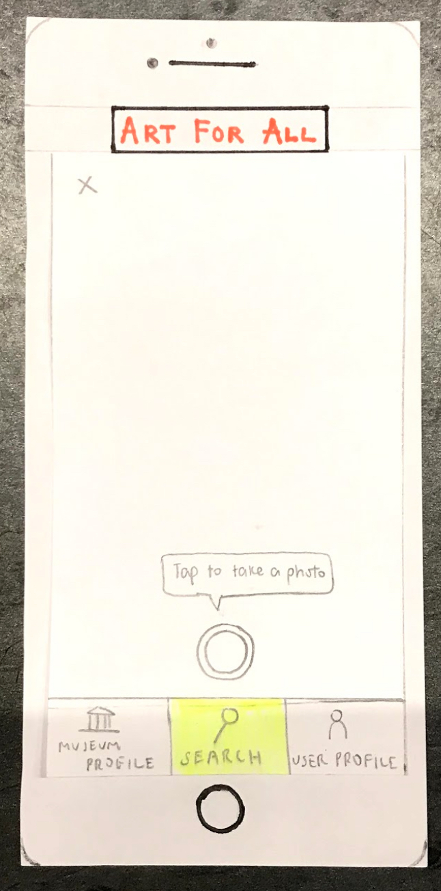
<figcaption>Camera screen</figcaption>
</figure>
<figure>
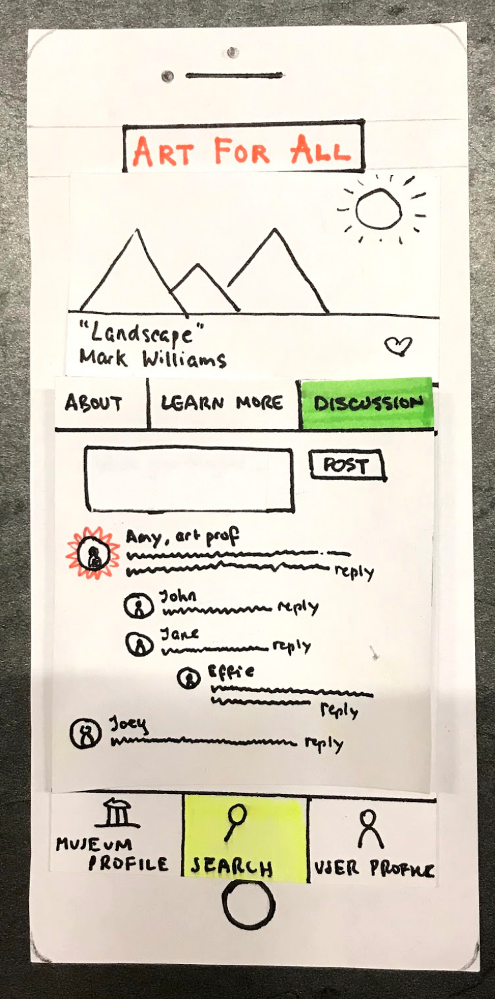
<figcaption>Discussion screen</figcaption>
</figure>

### After:
Revision: The design should only provide information that is needed and is helpful to the user. We decided to drop the bottom bar wherever it was easy for the user to still go back one page and find the bottom bar easily should they need it.
<figure>
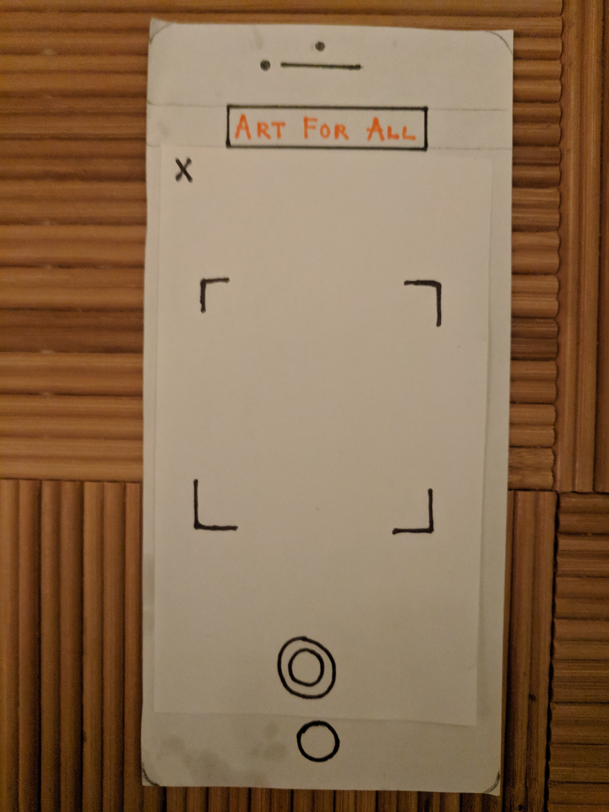
<figcaption>Camera screen removes toolbar</figcaption>
</figure>
<figure>
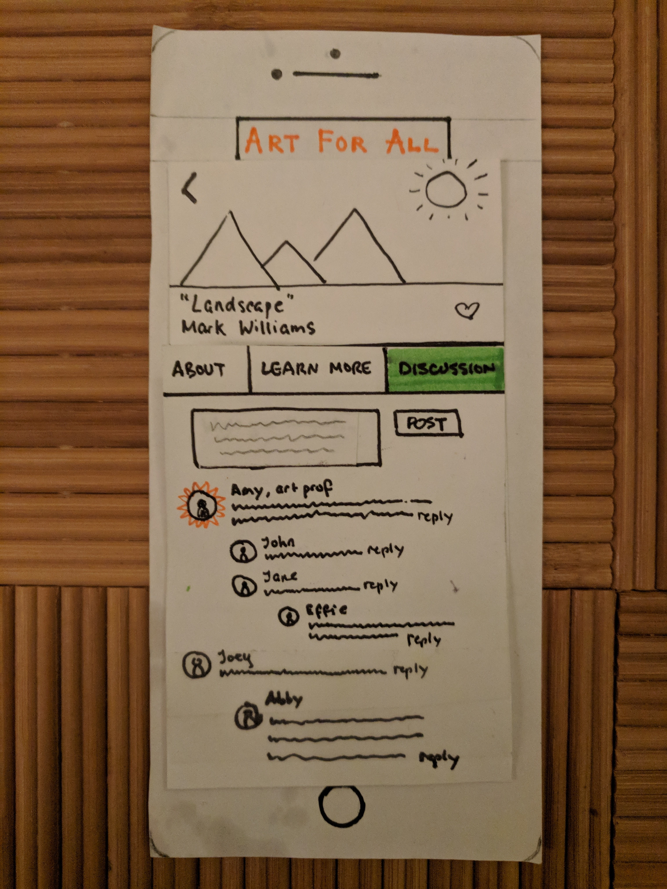
<figcaption>Discussion screen removes toolbar</figcaption>
</figure>

## Usability Testing Results
We encountered the following critical incidents from our usability tests, broken down by each usability test in order:

## Results from Test 1
## 1. Re-organizing the “About More” and “Learn More” content
### Before:  
While trying to navigate to a page that contained the inspiration for an artwork, we realized that it wasn’t clear to a general user whether the inspiration information should be under “about” or “learn more.” This led us to believe we may want to put more information about the inspiration and context under the “about” tab, and leave very in-depth understanding to the “learn more” section (e.g. further information about the artist and the history of the movement).
<figure>
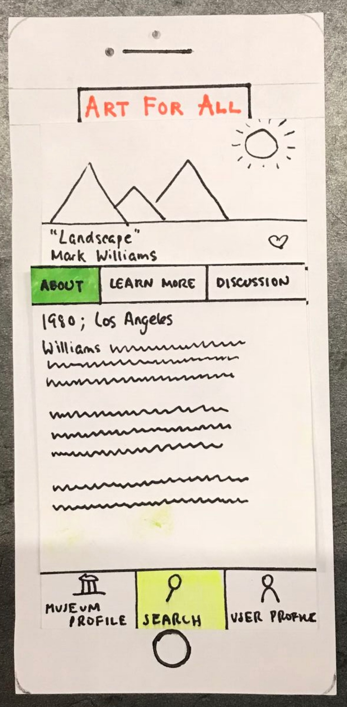
<figcaption>About screen under artwork profile</figcaption>
</figure>
<figure>
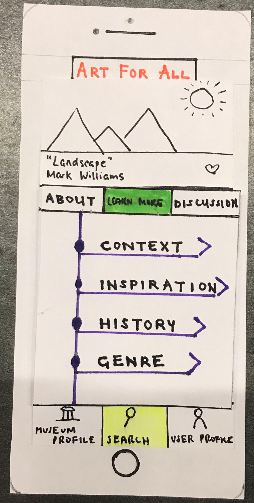
<figcaption>Learn More screen under artwork profile</figcaption>
</figure>

### After:
Revision: The “About” page was modified to contain information that used to be in the “Learn More” section, and the “Learn More” section was modified to be a series of very in-depth information.
<figure>
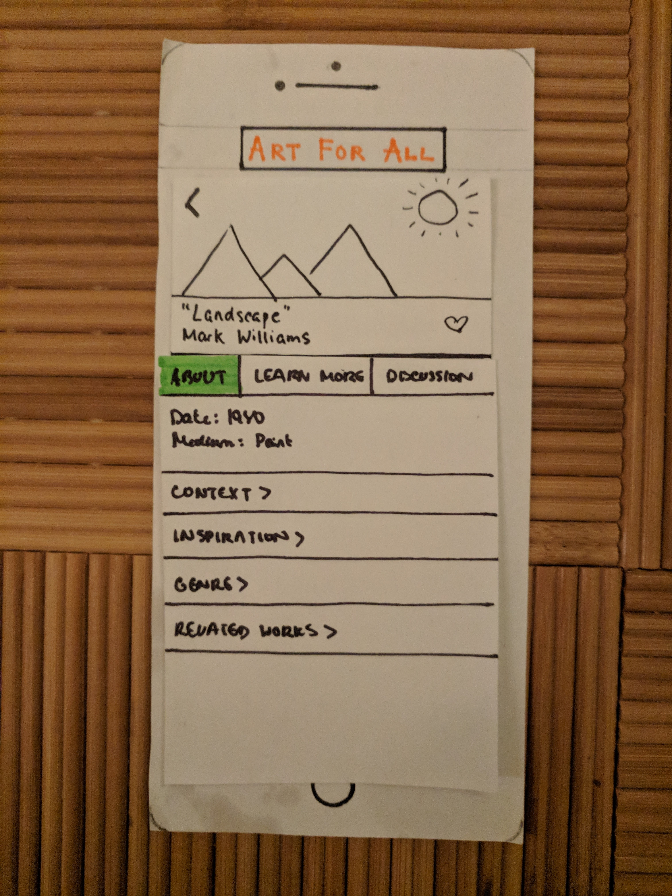
<figcaption>New About Page</figcaption>
</figure>

<figure>
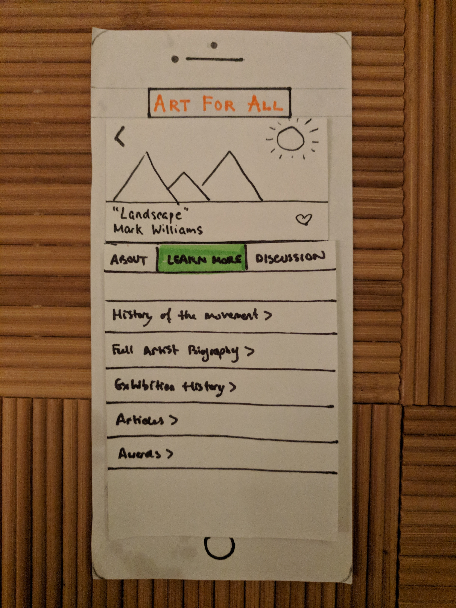
<figcaption>New Learn More Page</figcaption>
</figure>

## 2. QR code scanner
### Before:
While trying to “fake” taking a scan of the QR code, our user noted that he didn’t really know where to put the QR code, and that it would be nice to have a box on the camera screen so the user knows exactly where to put it.
<figure>
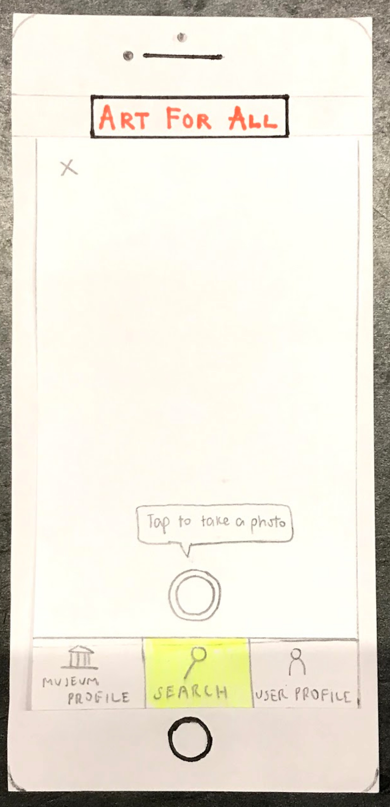
<figcaption>QR Scanner</figcaption>
</figure>

### After:
Revision: Adding a box/grid layout to indicate where the QR code should be captured.

## Results from Test 2
## 1. Favoriting artworks
### Before:
Favoriting and adding artworks to the user’s profile was not readily apparent. Although participant 2 was able to discover this feature after exploring the application and browsing his user profile, the discovery was only in hindsight after he had already left the artwork profile screen. Because favoriting artworks is one of our six primary tasks and the main feature of the user profile, this feature needed to be made more obvious.
<figure>

<figcaption>Old favorite button</figcaption>
</figure>

### After:
Revision:  Our solution was to change the favorite button into a more visible button right underneath the work’s title. We also added some more explicit text to make this functionality even more obvious.
<figure>
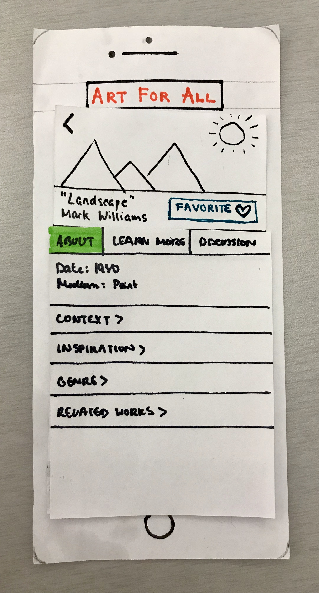
<figcaption>New favorite button</figcaption>
</figure>

## 2. QR Code Search Tutorial
### Before:
The user did not understand the capability to scan QR codes. 
<figure>
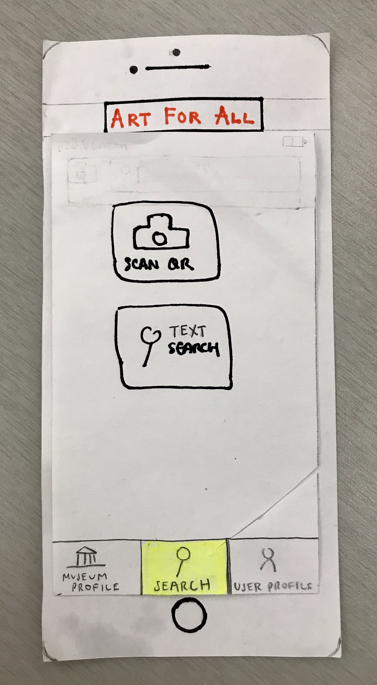
<figcaption>Old initial search screen</figcaption>
</figure>

### After:
Revision: To solve this problem of not effectively communicating the ability to use QR codes to look up artworks, upon launching the “Search” mode for the first time, a one-time tutorial overlay page outlines the QR code look-up process for the user.
<figure>
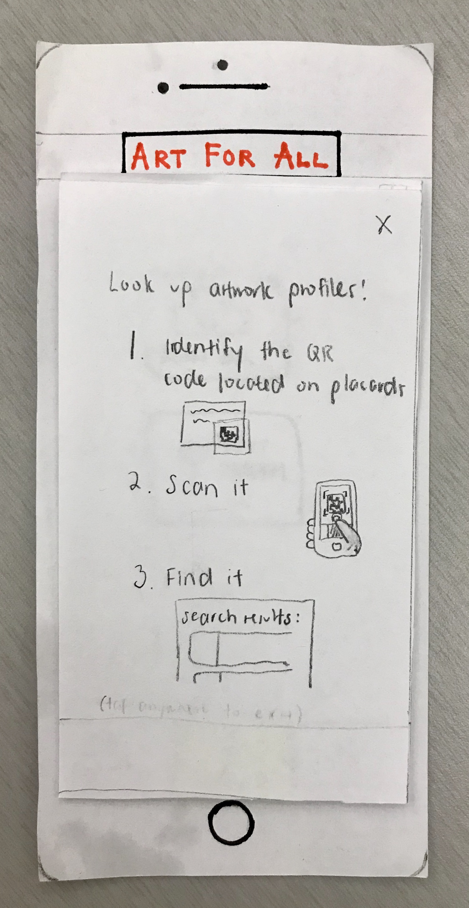
<figcaption>New initial search screen</figcaption>
</figure>

## Results from Test 3
## 1. Confusing syntax
### Before:
Some of the syntax employed resulted in negative incidents, as they did not successfully translate their ascribed functionality. In particular, on the search page, participant 3 didn’t understand the difference between being in the “Search” mode and the button option to “Search.” Additionally, she did not recognize that the “Threads” section of the User Profile would display the threads she participated in.
<figure>
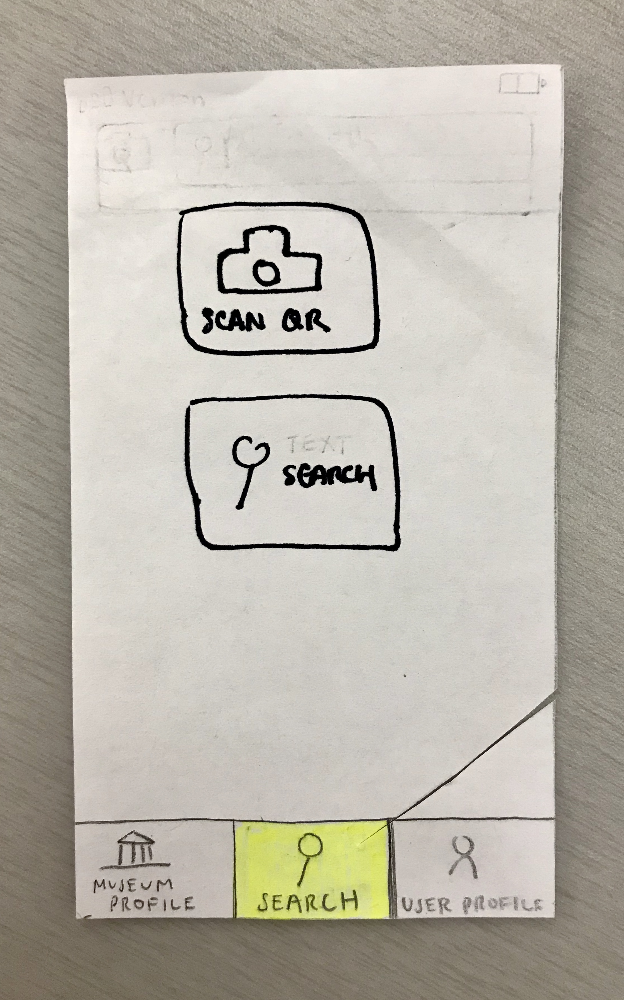
<figcaption>Old search syntax</figcaption>
</figure>

<figure>
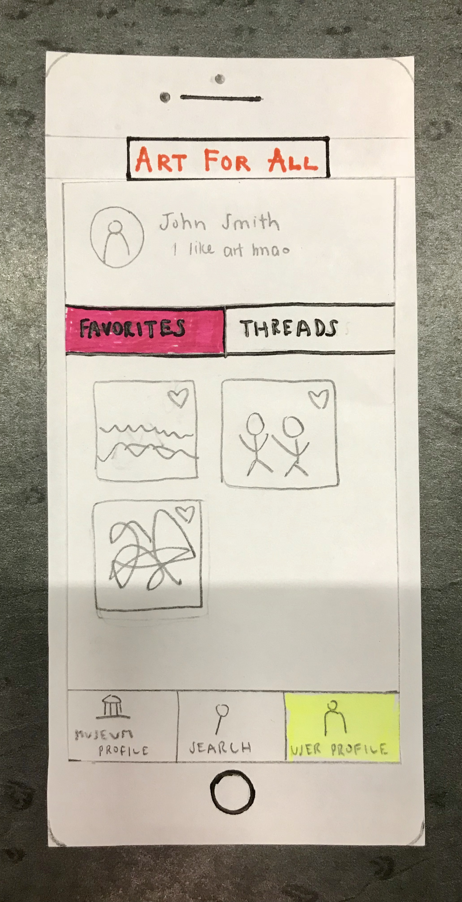
<figcaption>Old thread syntax</figcaption>
</figure>

### After:
Revision: Words were changed to better suit the user’s vocabulary and increase the usability of these key interactions. We changed the text for searching by text to “Text Search” instead of just “Search,” and changed the “Threads” tab to say “Your Threads”.
<figure>
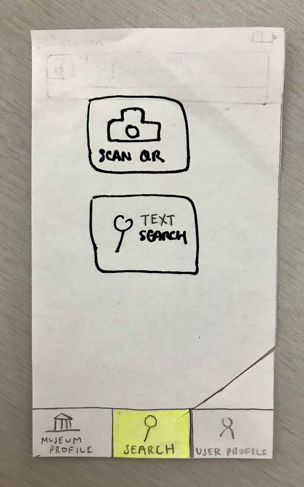
<figcaption>New search syntax</figcaption>
</figure>

<figure>
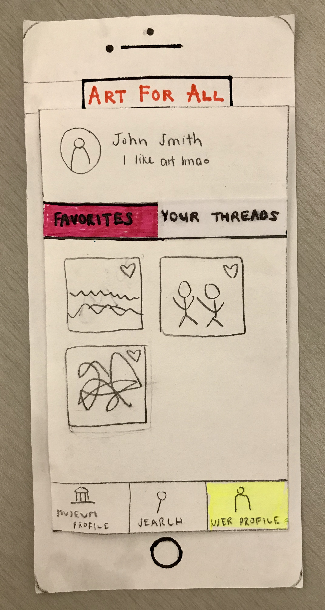
<figcaption>New thread syntax</figcaption>
</figure>

## 2. Launch screen
### Before:
Upon opening the application and being shown the initial screen for the “Search mode,” the user went to the “Museum Profile” for the purposes of initially exploring the application. This incident was negative, as the order of interaction was not intuitive to our test users. 

### After:
Revision: The launch screen was modified to an initial museum profile screen. It places the app within the user’s settings by communicating that the app is museum-specific and clearly defining what artwork is covered. The museum profile orients the user toward accomplishing the task of searching art pieces.
<figure>
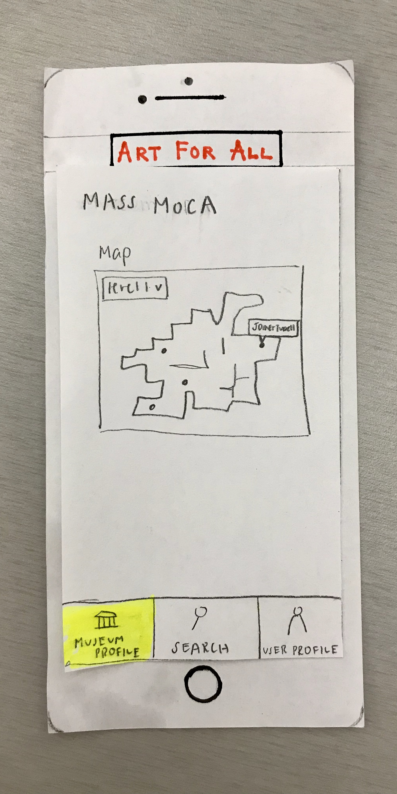
<figcaption>Launch screen</figcaption>
</figure>

